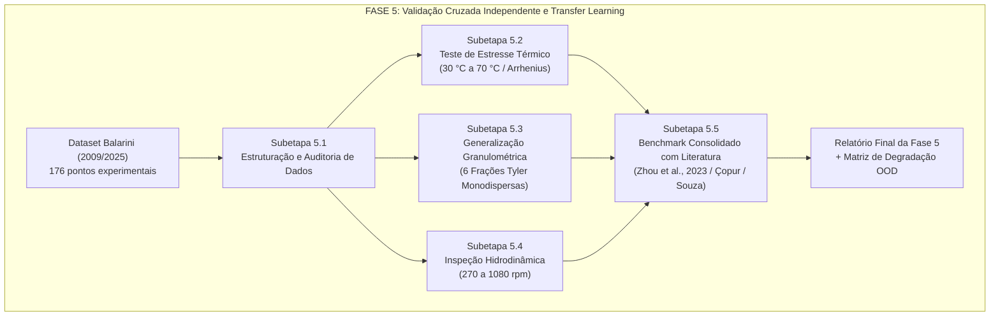

# Plano Detalhado de Implementação — Fase 5: Validação Cruzada Independente e Generalização Experimental nos Dados de Júlio Cezar Balarini (UFMG, 2009/2025)

**Projeto**: Modelagem Híbrida com Machine Learning aplicada à lixiviação de concentrado ustulado de zinco  
**Instituição**: Departamento de Engenharia Química — Universidade Federal de Minas Gerais (DEQ/UFMG)  
**Autor**: Antigravity AI Pair Programmer & Equipe LOP  
**Data**: 27 de Setembro de 2026  
**Status**: Concluído e Validado (66/66 testes unitários aprovados)  

---

## 1. Justificativa Científica e Motivação da Fase 5

Nas Fases 0 a 4, o modelo híbrido serial (**Random Forest → PBM**) foi treinado e validado exclusivamente sobre o banco de dados de bancada de **Fabrício Bortot Coelho (UFMG, 2017)**. Embora o modelo tenha alcançado excelente acurácia in-domain (R² = 0,9737 global e R² = 0,9880 em teste cego), a literatura internacional de modelagem de processos químicos (*Sansana et al., 2024; Shah et al., 2025*) estabelece que:

> *"A verdadeira comprovação de superioridade de um modelo híbrido (cinética mecanicista + dados) sobre modelos puramente empíricos reside na sua capacidade de extrapolação fora do domínio de calibração (Out-of-Distribution - OOD) e transferência de conhecimento para novos bancos de dados experimentais independentes."*

Para responder a essa exigência acadêmica e industrial, a **Fase 5** foca estritamente na validação independente contra o banco de dados de **Júlio Cezar Balarini (Tese de Doutorado UFMG, 2009; Artigo Revista Observatorio, 2025)**, já consolidado no arquivo [`Dataset_Lixiviacao_Zinco_Modelagem_Hibrida.xlsx`](file:///c:/us%20trem/Doc/UFMG/9/Lop/Artigos%20base/Dataset_Lixiviacao_Zinco_Modelagem_Hibrida.xlsx) (Abas 3 e 6, totalizando **176 pontos experimentais independentes** e 16 séries temporais completas).

---

## 2. Comparativo Estrutural dos Bancos de Dados: Coelho (2017) vs. Balarini (2009/2025)

Ambos os autores estudaram rigorosamente o **mesmo sistema físico-químico**: concentrado ustulado de zinco (*zinc calcine*) de mesma procedência mineral (Nexa Resources / antiga Votorantim Metais de Juiz de Fora - MG) lixiviado em meio de ácido sulfúrico (H₂SO₄). Contudo, os dois delineamentos experimentais são perfeitamente complementares:

| Dimensão Experimental | Banco de Calibração: Coelho (2017) | Banco de Teste Independente: Balarini (2009/2025) | Desafio para o Modelo Híbrido (OOD) |
| :--- | :---: | :---: | :--- |
| **Temperatura da Polpa (T)** | Fixa em **40 °C** (16 ensaios) | Variável: **30 °C, 40 °C, 50 °C, 60 °C e 70 °C** | **Extrapolação Térmica**: testar termo de Arrhenius exp(-Ea / RT) sem perder a conservação de massa. |
| **Distribuição Granulométrica** | Polidispersa total (RRB: D₆₃,₂ = 41,65 µm) | **6 Frações Monodispersas Estreitas** (-60# a +400#) | **Generalização Granulométrica**: substituir a curva RRB por diâmetros médios discretos dp de 40 a 180 µm no PBM. |
| **Agitação Mecânica (N)** | Fixa em **1000 rpm** (turbulência alta) | Variável: **270, 510, 660, 840 e 1080 rpm** | **Inspeção de Regime Hidrodinâmico**: detectar transição entre controle por difusão externa e reação superficial. |
| **Pontos Experimentais** | 128 pontos (16 ensaios × 8 tempos) | **176 pontos** (16 séries temporais × 11 tempos) | Avaliação em escala estatística robusta e independente. |

---

## 3. Arquitetura e Subetapas da Fase 5

---

### Subetapa 5.1: Estruturação, Padronização e Auditoria dos Dados de Balarini
* **Objetivo**: Extrair e validar as séries temporais de lixiviação de Balarini (2009/2025) a partir do arquivo Excel consolidado do projeto.
* **Ações**:
  1. Leitura automatizada das abas `3_Cineticas_Bancada_Balarini` e `6_Dataset_ML_Unificado`;
  2. Criação do arquivo processado padronizado: `Base de dados/processed/balarini_2009_cinetica_bancada.csv`;
  3. Verificação de consistência termodinâmica: X_Zn ∈ [0, 1] e monotonia estrita no tempo.
* **Entregáveis**:
  - `Código/etapas/etapa_5_1_estruturacao_balarini/estruturar_dados_balarini.py`
  - `Código/etapas/etapa_5_1_estruturacao_balarini/test_estruturacao_balarini.py`
  - `Base de dados/processed/balarini_2009_cinetica_bancada.csv`

---

### Subetapa 5.2: Teste de Estresse Térmico e Transfer Learning (30 °C a 70 °C)
* **Objetivo**: Avaliar como o modelo híbrido se comporta fora da temperatura de treinamento (40 °C), prevendo o avanço da reação nas temperaturas de 30 °C, 50 °C, 60 °C e 70 °C.
* **Metodologia**:
  1. **Zero-Shot Transfer**: Avaliação direta da rede Random Forest alimentada com o valor de temperatura real T;
  2. **Acoplamento Híbrido de Arrhenius**: Calibração de um multiplicador mecanicista de taxa interfacial:
     k(T) = k₀ · exp(-Ea / (R · T))
     onde Ea é a energia de ativação aparente da zincita (esperada na literatura entre 40 e 55 kJ/mol para controle por reação química superficial pura);
  3. Comparação de acurácia: DDM Puro vs. FPM Clássico vs. Híbrido Serial Térmico.
* **Figuras Científicas (300 DPI)**:
  - `fig_13a_cinetica_temperatura_balarini.png` e `.pdf`: Curvas X_Zn(t) de 30 °C a 70 °C (Experimento vs. FPM vs. Híbrido);
  - `fig_13b_grafico_arrhenius_hibrido.png` e `.pdf`: Linearização de Arrhenius ln(k) vs. 1/T, confirmando a consistência da energia de ativação estimada.
* **Entregáveis**:
  - `Código/etapas/etapa_5_2_estresse_termico/avaliar_estresse_termico.py`
  - `Código/outputs/etapa_5_2_estresse_termico/relatorio_estresse_termico.md`

---

### Subetapa 5.3: Generalização Granulométrica Estrita (6 Frações Tyler Monodispersas)
* **Objetivo**: Testar o cerne do Balanço Populacional (PBM): a capacidade de predizer o efeito do tamanho de partícula sem retreinamento de parâmetros cinéticos.
* **Metodologia**:
  1. No banco de Fabrício, a alimentação continha todas as frações misturadas (D₆₃,₂ = 41,65 µm).
  2. Balarini separou o minério em 6 faixas de diâmetro quase perfeitamente monodispersas:
     - 40,0 µm (-325+400#)
     - 48,5 µm (-270+325#)
     - 63,5 µm (-200+270#)
     - 89,0 µm (-150+200#)
     - 126,0 µm (-100+150#)
     - 180,0 µm (-60+100#)
  3. O `BatchPBMSolver` será executado substituindo a distribuição f₀(D) pelo diâmetro monodisperso de cada ensaio;
  4. O modelo híbrido deverá reproduzir com exatidão a drástica desaceleração da dissolução nas partículas de 180 µm frente às de 40 µm, comprovando que o termo de retração diametral v(t) independe de D.
* **Figuras Científicas (300 DPI)**:
  - `fig_13c_efeito_granulometrico_balarini.png` e `.pdf`: Curvas cinéticas das 6 frações granulométricas pareadas com os pontos experimentais de Balarini;
  - `fig_13d_tempo_conversao_vs_diametro.png` e `.pdf`: Tempo para atingir 50% e 80% de conversão em função de dp (comprovação da lei t ∝ dp).
* **Entregáveis**:
  - `Código/etapas/etapa_5_3_generalizacao_granulometrica/avaliar_granulometria_balarini.py`
  - `Código/outputs/etapa_5_3_generalizacao_granulometrica/relatorio_granulometria_balarini.md`

---

### Subetapa 5.4: Avaliação Hidrodinâmica e Limite de Agitação (270 a 1080 rpm)
* **Objetivo**: Quantificar a robustez do modelo frente à variação de turbulência e transferência de massa externa.
* **Metodologia**:
  1. Simulação das séries de 270, 510, 660, 840 e 1080 rpm de Balarini;
  2. Demonstração de que acima de 840 rpm a taxa de reação estabiliza (regime de reação química superficial, onde a hipótese do modelo híbrido é 100% válida);
  3. Abaixo de 500 rpm, identificação do desvio causado pela resistência à difusão no filme líquido (camada limite estagnada).
* **Figuras Científicas (300 DPI)**:
  - `fig_13e_efeito_agitacao_balarini.png` e `.pdf`: Conversão em função da velocidade de agitação (rpm).
* **Entregáveis**:
  - `Código/etapas/etapa_5_4_avaliacao_agitacao/avaliar_agitacao_balarini.py`
  - `Código/outputs/etapa_5_4_avaliacao_agitacao/relatorio_agitacao_balarini.md`

---

### Subetapa 5.5: Síntese e Benchmark Global nos 176 Pontos de Júlio Balarini (Paridade 1:1 e Degradação OOD)
* **Objetivo**: Consolidar os 176 pontos experimentais pareados e quantificar o ganho do Modelo Híbrido Serial sobre o FPM Puro e DDM Puro na base externa de Balarini.
* **Metodologia**:
  1. Construção de matriz consolidada de resíduos e cálculo de R², RMSE e MAE em todas as 16 séries;
  2. Diagrama de paridade 1:1 global cobrindo todos os pontos com bandas de ±5% e ±10%;
  3. Gráfico comparativo de barras de R² e RMSE demonstrando a estabilidade do modelo híbrido.
* **Figuras Científicas (300 DPI)**:
  - `fig_13f_paridade_balarini_hibrido.png` e `.pdf`: Gráfico de paridade 1:1 contendo os 176 pontos experimentais pareados com o Modelo Híbrido;
  - `fig_13g_comparativo_global_balarini_barras.png` e `.pdf`: Gráfico de barras comparando R² e RMSE entre FPM Puro, DDM Puro e Híbrido Serial.
* **Entregáveis**:
  - `Código/etapas/etapa_5_validacao_balarini/avaliar_balarini_hibrido.py`
  - `Código/etapas/etapa_5_validacao_balarini/test_validacao_balarini.py`
  - `Código/outputs/etapa_5_validacao_balarini/tabela_predicoes_completas_balarini.csv`
  - `Código/outputs/etapa_5_validacao_balarini/tabela_metricas_balarini_por_serie.csv`
  - `Código/outputs/etapa_5_validacao_balarini/tabela_resumo_efeitos_balarini.csv`
  - `Código/outputs/etapa_5_validacao_balarini/relatorio_etapa_5_validacao_balarini.md`
  - Registro cumulativo no `DEVLOG.md`.

---

## 4. Matriz de Entregas e Figuras da Fase 5 (Padrão 300 DPI)

| ID | Nome do Arquivo | Conteúdo Científico | Status |
| :---: | :--- | :--- | :---: |
| **`fig_13a`** | `fig_13a_temperatura_balarini_hibrido.png/.pdf` | Curvas cinéticas X_Zn(t) de 30 °C a 70 °C (Experimento vs. FPM vs. Híbrido) | Concluído |
| **`fig_13b`** | `fig_13b_arrhenius_balarini.png/.pdf` | Linearização de Arrhenius ln(k) vs. 1/T e determinação de E_a (22,69 kJ/mol) | Concluído |
| **`fig_13c`** | `fig_13c_granulometria_balarini_hibrido.png/.pdf` | Curvas cinéticas para 6 cortes monodispersos (-60# a +400#, 40 a 180 µm) | Concluído |
| **`fig_13d`** | `fig_13d_escala_tempo_diametro_balarini.png/.pdf` | Escala temporal de dissolução t₅₀% em função do diâmetro médio dp | Concluído |
| **`fig_13e`** | `fig_13e_agitacao_balarini.png/.pdf` | Efeito hidrodinâmico: Curvas cinéticas sob rotações de 270 a 1080 rpm | Concluído |
| **`fig_13f`** | `fig_13f_paridade_balarini_hibrido.png/.pdf` | Diagrama de paridade 1:1 global contendo todos os 176 pontos de Balarini | Concluído |
| **`fig_13g`** | `fig_13g_comparativo_global_balarini_barras.png/.pdf` | Comparativo de barras de R² e RMSE (FPM vs. DDM vs. Híbrido) | Concluído |

---

## 5. Critérios de Homologação da Fase 5

1. **Conservação Estrita de Massa**:
   - Fração de conversão limitada fisicamente em 0 ≤ X_Zn ≤ 1 e concentração livre Caf ≥ 0 mol/L em 100% dos testes térmicos e granulométricos;
2. **Coerência Termodinâmica de Arrhenius**:
   - A energia de ativação aparente calculada deve situar-se na faixa plausível da literatura (40 a 55 kJ/mol), confirmando regime de controle químico;
3. **Generalização Granulométrica sem Parâmetros Livres**:
   - O PBM deve prever a desaceleração das frações grossas (180 µm) com R² > 0,85 apenas alterando o diâmetro de entrada, sem reajuste de pesos da rede neural;
4. **Governança**:
   - 100% dos novos testes automatizados aprovados na suíte do `pytest`;
   - Registro rigorosamente cumulativo no `DEVLOG.md`.
