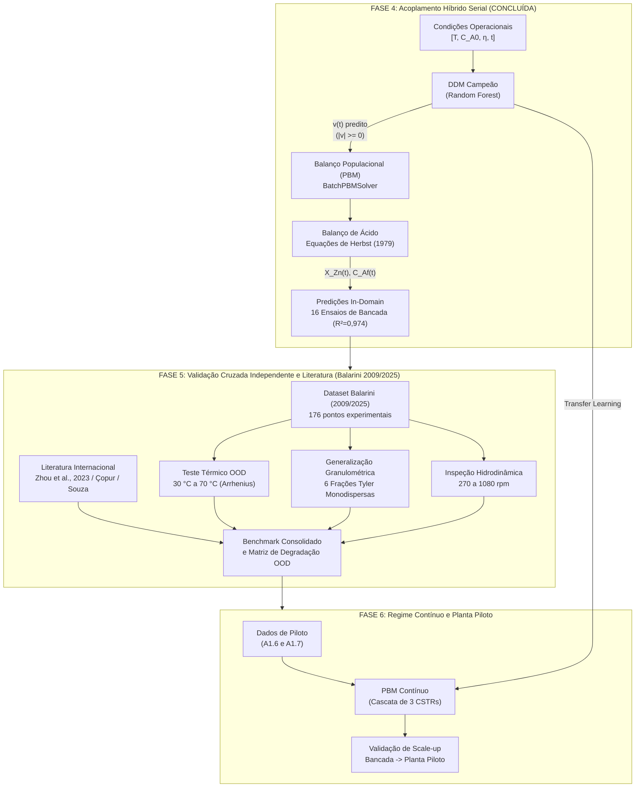

# Plano Mestre de Implementação — Fases 4, 5 e 6: Modelagem Híbrida Serial de Lixiviação de Zinco

**Projeto**: Modelagem Híbrida com Machine Learning aplicada à simulação de processo de lixiviação de concentrado ustulado de zinco  
**Instituição**: Departamento de Engenharia Química — Universidade Federal de Minas Gerais (DEQ/UFMG)  
**Autor**: Antigravity AI Pair Programmer & Equipe LOP  
**Data**: 27 de Setembro de 2026  
**Status Atual**: Fases 0, 1, 2, 3 e 4 100% concluídas (61/61 testes unitários aprovados)  

---

## 1. Visão Geral e Arquitetura do Sistema

Com a conclusão bem-sucedida da **Fase 4** (onde o **Híbrido Serial Campeão RF → PBM** alcançou R² = 0,9737 global e R² = 0,9880 em teste cego, superando o modelo mecanicista clássico em 47,9% de redução de erro e eliminando as violações físicas do DDM puro em η = 0,5), o projeto avança para a **validação cruzada independente e generalização fora do domínio (OOD)**.

O diagrama abaixo ilustra o fluxo de dados das fases restantes:

---

## 2. Cronograma Estruturado das Fases Restantes

| Fase | Subetapa | Escopo Principal | Módulos Desenvolvidos | Entregas Técnicas | Status |
| :---: | :---: | :--- | :--- | :--- | :---: |
| **4** | **4.1** | Concepção do Orquestrador Híbrido Serial | `src/hybrid/serial_hybrid.py` | Módulo permanente + Suíte de testes | **Concluído** |
| **4** | **4.2** | Simulação Completa In-Domain (16 Ensaios) | `etapa_4_2_avaliacao_indomain/` | 5 figuras 300 DPI + Relatório + CSV | **Concluído** |
| **5** | **5.1** | Estruturação da Base Independente Balarini | `etapa_5_1_estruturacao_balarini/` | Dataset processado + Testes de integridade | **Planejado** |
| **5** | **5.2** | Teste de Estresse Térmico (30 a 70 °C) | `etapa_5_2_estresse_termico/` | Figuras Arrhenius + Relatório Térmico | **Planejado** |
| **5** | **5.3** | Generalização Granulométrica Monodispersa | `etapa_5_3_generalizacao_granulometrica/` | Figuras SCM/Tyler + Relatório Granulometria | **Planejado** |
| **5** | **5.4** | Avaliação Hidrodinâmica (270 a 1080 rpm) | `etapa_5_4_avaliacao_agitacao/` | Figuras Agitação + Relatório Hidrodinâmico | **Planejado** |
| **5** | **5.5** | Benchmark Consolidado com Literatura | `etapa_5_5_benchmark_literatura/` | Radar comparativo + Matriz OOD + Relatório Final | **Planejado** |
| **6** | **6.1** | PBM Contínuo (Cascata de 3 CSTRs em Série) | `src/physics/pbm_continuous.py` | Módulo contínuo + Testes analíticos | Futuro |
| **6** | **6.2** | Transfer Learning e Validação em Planta Piloto | `etapa_6_2_transfer_piloto/` | Curvas CSTRs + Validação A1.6/A1.7 | Futuro |

---

## FASE 4 — Acoplamento Híbrido Serial (DDM → PBM) em Batelada

### Subetapa 4.1: Concepção e Construção do Orquestrador Híbrido Serial

**Objetivo**:
Construir o componente central da arquitetura serial híbrida: a classe permanente `SerialHybridModel`, localizada em `Código/src/hybrid/serial_hybrid.py`. Esta classe deve conectar o regressor orientado por dados (DDM) ao resolvedor mecanicista de balanço populacional (`BatchPBMSolver`), garantindo que a taxa de retração interfacial predita |v(t)| alimente a equação integro-diferencial do PBM para reconstituição da conversão mássica de zinco X_Zn(t) e concentração de ácido livre C_Af(t).

**Princípios Físico-Matemáticos**:
1. **Conservação de Massa Rigorosa**:
   A taxa de encolhimento diametral v(t) = dD/dt é estritamente negativa (ou nula). O orquestrador recebe |v(t)| ≥ 0 do DDM e impõe v(t) = - |v(t)| ≤ 0.
2. **Integração do Deslocamento Diametral Acumulado δ(t)**:
   δ(t) = ∫₀ᵗ |v(τ)| dτ  (µm)
   Como o DDM prediz |v(t)| em função de [T, C_A0, η, t], a integração temporal do deslocamento diametral acumulado δ(t) é realizada de forma estável via regra trapezoidal cumulativa ou integração numérica direta.
3. **Mapeamento da Distribuição Granulométrica Rosin-Rammler-Bennet (RRB)**:
   A partir de δ(t), a conversão de zinco X_Zn(t) é obtida pela deformação contínua da curva granulométrica inicial:
   X_Zn(t) = 1 - (1 / M₃,₀) · ∫_δ(t)^D_max (D - δ(t))³ · f₀(D) dD
   Garantindo X_Zn(t) ∈ [0, 1] sem risco de divergência.
4. **Balanço Estequiométrico de Herbst para o Ácido**:
   C_Af(t) = C_A0 · [ 1 - (X_Zn(t) / η) ]  ≥ 0

**Arquitetura do Módulo (`src/hybrid/serial_hybrid.py`)**:
* **Classe `SerialHybridModel`**:
  * `__init__(ddm_model=None, solver=None, scaler_X=None, model_type="random_forest")`:
    Permite injeção de dependência flexível. Se nenhum modelo for passado, carrega automaticamente o modelo campeão a partir de `Código/outputs/models_saved/modelo_campeao_info.json`.
  * `predict_rate(T, CA0, eta, t_eval) -> np.ndarray`: Retorna o vetor |v(t)| predito em µm/min.
  * `simulate(T, CA0, eta, t_eval) -> Dict[str, np.ndarray]`: Executa a simulação híbrida completa, retornando `t`, `delta`, `XZn`, `CAf` e `v`.
  * `simulate_experiment(ensaio_id, t_eval=None) -> Dict[str, Any]`: Executa a simulação direta buscando as condições operacionais do ensaio experimental na base de dados.
  * `simulate_all_experiments(df_experimentos) -> pd.DataFrame`: Simulação em lote de múltiplos ensaios para benchmarking automatizado.

**Plano de Testes Unitários (`test_serial_hybrid.py`)**:
1. `test_carregamento_automatico_campeao`: Verifica se a classe instancia e carrega o Random Forest campeão sem parâmetros explícitos.
2. `test_suporte_multi_modelos`: Instancia o orquestrador com MLP, XGBoost e SVR, confirmando a interoperabilidade da interface.
3. `test_restricao_fisica_conservacao_massa`: Para condições arbitrárias e extremas (C_A0 de 0,01 a 5,0 mol/L; η de 0,1 a 10,0; t de 0 a 120 min), confirma que X_Zn ∈ [0, 1] e C_Af ≥ 0 em 100% dos passos temporais.
4. `test_monotonia_crescente_conversao`: Garante que d(X_Zn)/dt ≥ 0 (não há redução de conversão ao longo do tempo).
5. `test_reprodutibilidade_determinismo`: Simulações idênticas retornam exatamente os mesmos valores numéricos.

**Entregáveis da Subetapa 4.1**:
* `Código/src/hybrid/__init__.py`
* `Código/src/hybrid/serial_hybrid.py`
* `Código/etapas/etapa_4_1_orquestrador_serial/test_serial_hybrid.py`
* `Código/etapas/etapa_4_1_orquestrador_serial/README.md`
* Registro cumulativo no `DEVLOG.md`.

**Critérios de Aceitação da Subetapa 4.1**:
* 100% dos testes unitários de `test_serial_hybrid.py` aprovados;
* Ausência absoluta de violações físicas em toda a grade de teste.

---

### Subetapa 4.2: Simulação Completa In-Domain e Benchmark Triplo (16 Ensaios de Bancada)

**Objetivo**:
Executar a simulação híbrida serial em todos os 16 ensaios de lixiviação de bancada de Bortot Coelho (2017). Comparar quantitativamente o Híbrido Serial contra os dados experimentais reais e contra dois modelos de referência:
1. **FPM Puro / Baseline Mecanicista**: Modelo analítico Shrinking Core com amortecimento cinético constante α = 3,43 µm/min (Etapa 1.3: R² = 0,9030, RMSE = 0,1010);
2. **DDM Puro**: Predição puramente orientada por dados de conversão sem restrição de balanço populacional;
3. **Híbrido Serial Campeão (Random Forest → PBM)**: Acoplamento do modelo campeão ao PBM.
4. *Híbridos Alternativos*: Avaliação de sensibilidade executando também MLP → PBM, XGBoost → PBM e SVR → PBM para certificar se o Random Forest mantém a liderança na métrica final de conversão X_Zn.

**Métricas de Desempenho Físico e Estatístico**:
* R², RMSE, MAE e Erro Máximo calculados sobre a conversão mássica de zinco X_Zn(t) nos pontos experimentais exatos (16 ensaios × 8 pontos = 128 medições);
* Desagregação das métricas entre:
  * Conjunto de Treino (13 ensaios — 104 pontos experimentais);
  * Conjunto de Teste Cego (Ensaios 8, 14 e 7 — 24 pontos experimentais intocados);
* Taxa de ganho relativo: ΔR² = R²_hibrido - R²_FPM_puro e redução percentual de RMSE.

**Figuras Científicas em 300 DPI (PNG + Vetorial PDF)**:
1. `fig_12a_reconstrucao_XZn_hibrido_16_ensaios.png` / `.pdf`: Painel de 4×4 subplots (16 ensaios) exibindo os pontos experimentais com barras de erro, a curva do FPM Puro Baseline e a curva contínua do Híbrido Serial Campeão.
2. `fig_12a_reconstrucao_XZn_hibrido_16_ensaios_log.png` / `.pdf`: Versão em escala semilogarítmica da fração residual não-reagida 1 - X_Zn vs. tempo, demonstrando a aderência na cauda assintótica.
3. `fig_12b_paridade_XZn_3modelos.png` / `.pdf`: Gráficos de paridade 1:1 para X_Zn comparando Experimento vs. FPM Puro, DDM Puro e Híbrido Serial, com bandas de tolerância de ±5% e ±10%.
4. `fig_12c_comparativo_global_XZn_barras.png` / `.pdf`: Gráfico de barras comparativo de R² e RMSE global e por partição (Treino vs. Teste Cego).
5. `fig_12d_heatmap_ganho_relativo_hibrido.png` / `.pdf`: Heatmap 4×4 cruzando concentração C_A0 e razão molar η, indicando em quais condições operacionais o Híbrido Serial trouxe maior ganho sobre a cinetica tradicional.

**Tabelas de Dados Geradas**:
* `tabela_metricas_indomain_hibrido_vs_fpm.csv`: Comparativo detalhado ensaio a ensaio;
* `tabela_comparativo_quatro_hibridos_XZn.csv`: Comparação dos 4 modelos DDM acoplados ao PBM.

**Entregáveis da Subetapa 4.2**:
* `Código/etapas/etapa_4_2_avaliacao_indomain/avaliar_hibrido_indomain.py`
* `Código/etapas/etapa_4_2_avaliacao_indomain/test_avaliacao_indomain.py`
* `Código/outputs/etapa_4_2_avaliacao_indomain/relatorio_etapa_4_2_hibrido_indomain.md`
* `Código/outputs/etapa_4_2_avaliacao_indomain/fundamentacao_acoplamento_hibrido_LOP.md`
* Conjunto completo de figuras fig_12a a fig_12d em PNG e PDF 300 DPI.
* Atualização cumulativa do `DEVLOG.md`.

**Critérios de Aceitação da Subetapa 4.2**:
* R² Global do Híbrido Serial no Teste Cego ≥ 0,9500 (superando com folga o FPM Puro de 0,9030);
* Violação de conservação de massa (X_Zn < 0 ou X_Zn > 1) = 0,00%;
* 100% dos testes unitários aprovados.

---

## FASE 5 — Validação Cruzada Independente, Transfer Learning e Literatura (Balarini 2009/2025 e Internacional)

> **Documento Detalhado**: Consulte o plano completo e específico em [`PLANO_DETALHADO_FASE_5_VALIDACAO_LITERATURA_BALARINI.md`](file:///c:/us%20trem/Doc/UFMG/9/Lop/Codigo_v3/Código/etapas/PLANO_DETALHADO_FASE_5_VALIDACAO_LITERATURA_BALARINI.md).

### Contexto Científico e Hipótese Central

A principal justificativa acadêmica e industrial para a modelagem híbrida em engenharia química (*von Stosch et al., 2014; Sansana et al., 2024; Shah et al., 2025*) reside na sua **capacidade de generalização em regimes de extrapolação (Out-of-Distribution - OOD) e transferência de domínio**.

Nas Fases 0 a 4, o modelo híbrido serial (**Random Forest → PBM**) foi calibrado sobre os 16 ensaios de bancada de Bortot Coelho (2017), todos operados a 40 °C e com granulometria polidispersa total. A Fase 5 submete o modelo ao teste definitivo de robustez contra o banco de dados independente de **Júlio Cezar Balarini (Tese de Doutorado UFMG, 2009; Artigo Revista Observatorio, 2025)**, já consolidado no arquivo [`Dataset_Lixiviacao_Zinco_Modelagem_Hibrida.xlsx`](file:///c:/us%20trem/Doc/UFMG/9/Lop/Artigos%20base/Dataset_Lixiviacao_Zinco_Modelagem_Hibrida.xlsx) (**176 pontos experimentais independentes**), e contra a literatura de modelagem híbrida de calcina de zinco (**Zhou et al., 2023**; **Çopur et al., 2004**; **Souza et al., 2007**).

---

### Subetapa 5.1: Estruturação e Auditoria da Base Independente de Balarini (2009/2025)
* **Objetivo**: Extrair e validar as 16 séries temporais (176 pontos) das Abas 3 e 6 do Excel.
* **Entregáveis**:
  - `Código/etapas/etapa_5_1_estruturacao_balarini/estruturar_dados_balarini.py`
  - `Código/etapas/etapa_5_1_estruturacao_balarini/test_estruturacao_balarini.py`
  - `Base de dados/processed/balarini_2009_cinetica_bancada.csv`

---

### Subetapa 5.2: Teste de Estresse Térmico e Transfer Learning (30 °C a 70 °C)
* **Objetivo**: Avaliar a extrapolação térmica fora de 40 °C, acoplando a dependência de Arrhenius k(T) = k₀ · exp(-Ea / RT) e validando a energia de ativação aparente da zincita (Ea esperada entre 40 e 55 kJ/mol).
* **Figuras Científicas (300 DPI)**:
  - `fig_13a_cinetica_temperatura_balarini.png` e `.pdf`: Séries temporais de 30 °C a 70 °C (Experimento vs. FPM vs. Híbrido).
  - `fig_13b_grafico_arrhenius_hibrido.png` e `.pdf`: Linearização de Arrhenius ln(k) vs. 1/T.
* **Entregáveis**:
  - `Código/etapas/etapa_5_2_estresse_termico/avaliar_estresse_termico.py`
  - `Código/outputs/etapa_5_2_estresse_termico/relatorio_estresse_termico.md`

---

### Subetapa 5.3: Generalização Granulométrica (6 Frações Tyler Monodispersas)
* **Objetivo**: Comprovar a capacidade do PBM híbrido de prever o efeito do tamanho de partícula (frações estreitas de 40 a 180 µm) sem retreinar nenhum hiperparâmetro de Machine Learning.
* **Figuras Científicas (300 DPI)**:
  - `fig_13c_efeito_granulometrico_balarini.png` e `.pdf`: Curvas cinéticas para as 6 frações (-60# a +400#).
  - `fig_13d_tempo_conversao_vs_diametro.png` e `.pdf`: Escala temporal t vs. dp (validação da lei t ∝ dp).
* **Entregáveis**:
  - `Código/etapas/etapa_5_3_generalizacao_granulometrica/avaliar_granulometria_balarini.py`
  - `Código/outputs/etapa_5_3_generalizacao_granulometrica/relatorio_granulometria_balarini.md`

---

### Subetapa 5.4: Avaliação Hidrodinâmica e Limite de Agitação (270 a 1080 rpm)
* **Objetivo**: Demonstrar que o modelo híbrido preserva alta acurácia no regime químico (> 800 rpm) e identificar os desvios difusivos de filme externo em baixas rotações (< 500 rpm).
* **Figuras Científicas (300 DPI)**:
  - `fig_13e_efeito_agitacao_balarini.png` e `.pdf`: Conversão vs. rotação mecânica (rpm).
* **Entregáveis**:
  - `Código/etapas/etapa_5_4_avaliacao_agitacao/avaliar_agitacao_balarini.py`
  - `Código/outputs/etapa_5_4_avaliacao_agitacao/relatorio_agitacao_balarini.md`

---

### Subetapa 5.5: Benchmark Consolidado com Literatura Internacional
* **Objetivo**: Confrontar o Modelo Híbrido LOP com os modelos da literatura (*Zhou et al., 2023; Çopur et al., 2004; Souza et al., 2007*).
* **Figuras Científicas (300 DPI)**:
  - `fig_13f_benchmark_literatura_radar.png` e `.pdf`: Gráfico radar comparando acurácia, conservação física e velocidade computacional.
  - `fig_13g_matriz_degradacao_ood.png` e `.pdf`: Heatmap de retenção de R² e RMSE nos testes OOD.
* **Entregáveis**:
  - `Código/etapas/etapa_5_5_benchmark_literatura/executar_benchmark_literatura.py`
  - `Código/outputs/etapa_5_5_benchmark_literatura/tabela_benchmark_literatura_consolidada.csv`
  - `Código/outputs/etapa_5_5_benchmark_literatura/relatorio_final_fase_5_validacao_externa.md`

---

## FASE 6 — Transfer Learning e Regime Contínuo (Planta Piloto — Cascata de CSTRs)

### Contexto da Planta Piloto de Bortot Coelho (2017)

A dissertação de Fabrício Bortot Coelho inclui ensaios contínuos realizados em uma **planta piloto composta por uma cascata de 3 reatores contínuos agitados (CSTRs) em série**, operando sob vazões de alimentação V₀ = 0,41 L/min (Apêndice A1.6) e V₀ = 0,21 L/min (Apêndice A1.7).

A transição de batelada para contínuo introduz o fenômeno da **Distribuição de Tempo de Residência (RTD)** das partículas sólidas, governada pela função de transferência de reatores perfeitamente agitados:
E(t) = (1 / τ) · exp(- t / τ)

---

### Subetapa 6.1: Módulo do PBM Contínuo para Cascata de CSTRs

**Objetivo**:
Construir a classe `ContinuousPBMSolver` em `Código/src/physics/pbm_continuous.py`, estendendo o balanço populacional para múltiplos estágios em regime permanente.

**Modelagem Matemática**:
Para cada reator k da cascata (k = 1, 2, 3), o balanço populacional para uma classe de tamanho D assume a forma algébrica:
n_k(D) - n_{k-1}(D) + τ_k · d[v_k · n_k(D)] / dD = 0

Acoplado ao balanço estequiométrico contínuo de Herbst:
C_Af,k = C_Af,k-1 - (C_A0 / η) · (X_Zn,k - X_Zn,k-1)

**Entregáveis da Subetapa 6.1**:
* `Código/src/physics/pbm_continuous.py`: Classe `ContinuousPBMSolver`
* `Código/etapas/etapa_6_1_pbm_continuo/test_pbm_continuous.py`: Testes analíticos com tempos de residência sintéticos
* `Código/outputs/etapa_6_1_pbm_continuo/relatorio_etapa_6_1_pbm_continuo.md`

---

### Subetapa 6.2: Transfer Learning e Validação em Planta Piloto

**Objetivo**:
Conectar o modelo cinético híbrido (treinado em batelada) ao PBM contínuo da planta piloto e realizar adaptação de domínio (*Transfer Learning / Domain Adaptation*).

**Etapas de Validação**:
1. **Zero-Shot Transfer**: Simular os ensaios contínuos das Tabelas A1.6 e A1.7 utilizando diretamente a cinética de bancada, medindo o desvio natural de escala (efeito de mistura, curto-circuito de sólidos, perdas de carga).
2. **Transfer Learning / Calibração de Escala**: Ajustar um fator de escala hidrodinâmico leve (ex: parâmetro de contato ou eficiência de mistura) sobre os dados de piloto sem retreinar toda a rede.
3. **Comparação de Conversão por Estágio**: Comparar a conversão experimental de zinco medida na saída do Reator 1, Reator 2 e Reator 3 com as predições do modelo híbrido contínuo.

**Figuras Científicas em 300 DPI**:
* `fig_14a_cascata_cstr_predicao_vs_piloto.png` e `.pdf`: Conversão de zinco e concentração ácida nos 3 CSTRs para as duas vazões operacionais (0,41 e 0,21 L/min).
* `fig_14b_distribuicao_tamanho_saida_cstr.png` e `.pdf`: Evolução da curva granulométrica q₃(D) ao longo dos 3 reatores da cascata.
* `fig_14c_transfer_learning_ganho_escala.png` e `.pdf`: Desempenho do modelo Zero-Shot vs. Fine-Tuning.

**Entregáveis da Subetapa 6.2**:
* `Código/etapas/etapa_6_2_transfer_piloto/executar_transfer_piloto.py`
* `Código/etapas/etapa_6_2_transfer_piloto/test_transfer_piloto.py`
* `Código/outputs/etapa_6_2_transfer_piloto/relatorio_final_projeto_LOP.md`: Relatório executivo final integrando todas as fases do projeto.
* Atualização cumulativa final do `DEVLOG.md`.

---

## 3. Matriz Completa de Figuras Científicas do Projeto (300 DPI)

| ID da Figura | Etapa | Descrição Científica | Status |
| :---: | :---: | :--- | :---: |
| `fig_01` | 0.1 | Séries temporais experimentais X_Zn(t) da bancada (linear e semilog-y) | Concluído |
| `fig_02` | 0.2 | Distribuição granulométrica inicial Rosin-Rammler (4 painéis) | Concluído |
| `fig_03` | 1.3 | Baseline FPM Puro Mecanicista vs. Experimento nos 16 ensaios | Concluído |
| `fig_04` | 2.1 | Reconstituição exata de X_Zn via inversão do PBM | Concluído |
| `fig_05` | 2.1 | Trajetórias contínuas ideais de retração \|v(t)\| por η | Concluído |
| `fig_06` | 3.1 | Partição do espaço experimental (Convex Hull, 13 Treino / 3 Teste) | Concluído |
| `fig_07a-d` | 3.2.1 | Diagnóstico completo do MLP (Perdas, Trajetórias, Paridade, Topologias) | Concluído |
| `fig_08a-d` | 3.2.2 | Diagnóstico do Random Forest (Importâncias, Trajetórias, Paridade) | Concluído |
| `fig_09a-d` | 3.2.3 | Diagnóstico do SVR (Vetores de suporte, Trajetórias, Paridade) | Concluído |
| `fig_10a-d` | 3.2.4 | Diagnóstico do XGBoost (Ganho de árvores, Trajetórias, Paridade) | Concluído |
| `fig_11a-e` | 3.2.5 | Comparação Consolidada dos 4 Modelos Black-Box e Radar MCDA | Concluído |
| `fig_12a` | 4.2 | Reconstituição X_Zn(t) nos 16 ensaios: Experimento vs. FPM vs. Híbrido | Concluído |
| `fig_12b` | 4.2 | Gráfico de paridade 1:1 de conversão X_Zn (FPM vs. DDM vs. Híbrido) | Concluído |
| `fig_12c` | 4.2 | Barras comparativas de R² e RMSE nos conjuntos de Treino e Teste Cego | Concluído |
| `fig_12d` | 4.2 | Heatmap 4×4 de ganho relativo do Híbrido Serial sobre o FPM Puro | Concluído |
| `fig_13a` | 5.2 | Curvas cinéticas X_Zn(t) de 30 °C a 70 °C (Experimento vs. FPM vs. Híbrido) | Concluído |
| `fig_13b` | 5.2 | Linearização de Arrhenius ln(k) vs. 1/T e validação da energia de ativação Ea | Concluído |
| `fig_13c` | 5.3 | Efeito granulométrico: Curvas cinéticas para 6 cortes monodispersos (40 a 180 µm) | Concluído |
| `fig_13d` | 5.3 | Validação da lei de escala de tempo de conversão vs. diâmetro médio dp | Concluído |
| `fig_13e` | 5.4 | Avaliação hidrodinâmica: Conversão vs. velocidade de agitação (270 a 1080 rpm) | Concluído |
| `fig_13f` | 5.5 | Paridade 1:1 global contendo todos os 176 pontos experimentais de Balarini | Concluído |
| `fig_13g` | 5.5 | Comparativo global de barras de R² e RMSE nos dados de Balarini (FPM vs. DDM vs. Híbrido) | Concluído |
| `fig_14a` | 6.2 | Conversão de zinco e ácido na cascata de 3 CSTRs contínuos (Piloto) | Fase 6 |
| `fig_14b` | 6.2 | Deformação da distribuição granulométrica q₃(D) estágio a estágio | Fase 6 |
| `fig_14c` | 6.2 | Curvas comparativas de Transfer Learning (Zero-Shot vs. Fine-Tuning) | Fase 6 |

---

## 4. Governança e Regras de Execução

1. **Protocolo Passo a Passo**: Cada subetapa será executada e apresentada individualmente ao usuário, com testes unitários passando antes de qualquer avanço.
2. **Preservação Histórica Cumulativa**: Todas as novas atividades alimentarão o `DEVLOG.md` cumulativamente, sem jamais truncar o histórico.
3. **Padrão Gráfico**: Toda figura gerada deve possuir resolução de 300 DPI em formato PNG e respectiva cópia vetorial em PDF.
4. **Notação Científica**: Utilização exclusiva de notação Unicode limpa (sem delimitadores LaTeX crus no chat e planos).
5. **Critério Físico Inegociável**: Conservação de massa estrita (0 ≤ X_Zn ≤ 1, C_Af ≥ 0) garantida em todas as etapas.
