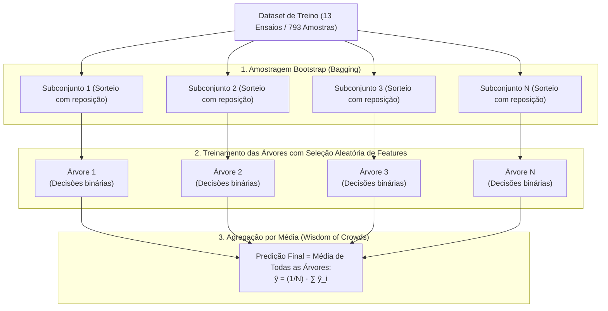

# Fundamentação Teórica e Aplicação Prática do Random Forest Regressor no Projeto LOP

**Projeto**: Modelagem Híbrida de Lixiviação de Zinco (DEQ/UFMG)  
**Subetapa**: 3.2.2 — Modelagem com Random Forest Regressor  
**Autor**: Antigravity AI Pair Programmer & Equipe LOP  
**Data**: 26 de Setembro de 2026  
**Finalidade**: Explicação didática, matemática e metodológica completa de como funciona o algoritmo Random Forest (desde os fundamentos estatísticos até o algoritmo prático) e de como ele foi especialmente formulado e adaptado para a predição da taxa de retração interfacial de partículas no processo de lixiviação ácida de zinco.

---

## 1. Visão Geral e Propósito no Projeto

Na hidrometalurgia do zinco via modelagem híbrida serial (DDM $\to$ FPM), o modelo orientado por dados (*Data-Driven Model* — DDM) não tenta prever diretamente a curva final de conversão $X_{\text{Zn}}(t)$. Em vez disso, seu papel é prever a grandeza fenomenológica intermediária fundamental: a **taxa linear de retração de diâmetro de partícula**, expressa em módulo por:

$$|v(t)| = \left|\frac{dD}{dt}\right| = f_{\text{ML}}\left( T,\ C_{A0},\ \eta,\ t \right) \quad (\mu\text{m/min})$$

Onde:
- $T$: Temperatura de reação ($40{,}0\ ^\circ\text{C}$ na bancada; mantida para futura transferência à planta piloto);
- $C_{A0}$: Concentração inicial de ácido sulfúrico livre ($0{,}10$ a $1{,}50\text{ mol/L}$);
- $\eta$: Razão molar estequiométrica ácido/minério ($0{,}5$ a $3{,}1$);
- $t$: Tempo transcorrido de reação ($0{,}0$ a $15{,}0\text{ min}$).

Dentre os quatro algoritmos avaliados na Etapa 3.2 (MLP, Random Forest, SVR e XGBoost), o **Random Forest Regressor** destaca-se por sua robustez estatística, interpretabilidade física direta e facilidade de ajuste sem risco de divergência numérica.

---

## PARTE 1: Como Funciona o Random Forest (Do Zero à Matemática)

O algoritmo **Random Forest** (Floresta Aleatória), introduzido por Leo Breiman em 2001, baseia-se no princípio dos métodos de *Ensemble* (aprendizado por comitê): combinar múltiplas árvores de decisão simples e independentes para formar um preditor conjunto de altíssima precisão e baixa variância.



---

### 1.1. A Unidade Básica: A Árvore de Decisão de Regressão

Uma **Árvore de Decisão** é uma estrutura hierárquica constituída por:
- **Nó Raiz (Root Node)**: Ponto de entrada de todos os dados;
- **Nós de Decisão Internos**: Divisões binárias baseadas em condições do tipo $x_j \le s$ (ex.: "tempo $\le 1{,}0\text{ min}$?");
- **Folhas (Leaf Nodes)**: Regiões terminais do espaço que fornecem o valor predito final.

#### Como a Árvore Aprende a Dividir os Dados?
Em cada nó, o algoritmo varre todas as variáveis disponíveis $x_j$ e todos os limiares de corte possíveis $s$, buscando a partição que maximize a **redução de variância** (ou minimização da soma de erros quadráticos ponderados):

$$\min_{j, s} \left[ \sum_{i \in R_1(j, s)} \left( y_i - \bar{y}_{R_1} \right)^2 + \sum_{i \in R_2(j, s)} \left( y_i - \bar{y}_{R_2} \right)^2 \right]$$

Onde $R_1(j, s) = \{x \mid x_j \le s\}$ e $R_2(j, s) = \{x \mid x_j > s\}$ são as duas novas regiões formadas, e $\bar{y}_{R_1}, \bar{y}_{R_2}$ são as médias amostrais do alvo em cada região.

#### Como a Árvore Faz a Predição?
Quando um dado com atributos $\mathbf{x} = [T, C_{A0}, \eta, t]$ percorre a árvore até chegar a uma folha $R_m$, a predição é simplesmente a média de todas as amostras de treino que caíram naquela mesma folha:

$$\hat{y}(\mathbf{x}) = \bar{y}_{R_m} = \frac{1}{N_m} \sum_{i \in R_m} y_i$$

#### O Grande Problema de uma Árvore Individual:
- **Alta Variância e Overfitting**: Se a árvore crescer livremente, ela memoriza o ruído das amostras de treino. Uma árvore individual profunda produz superfícies de predição ruidosas e cheias de descontinuidades em formato de degraus (*step functions*).
- **Instabilidade Numérica**: Uma pequena perturbação nos dados de treino pode alterar completamente as decisões de corte do nó raiz até as folhas.

---

### 1.2. O Conceito de Ensemble: "A Sabedoria das Massas"

A intuição matemática por trás do Ensemble é simples:
Se temos $M$ estimadores **independentes e não-correlacionados**, cada um com variância $\sigma^2$, a média das predições desses modelos terá uma variância drasticamente reduzida:

$$\text{Var}\left( \frac{1}{M} \sum_{i=1}^M \hat{y}_i \right) = \frac{\sigma^2}{M}$$

À medida que aumentamos o número de árvores $M$, a variância do conjunto decai sem que o viés (*bias*) aumente, resultando em uma curva suave, equilibrada e altamente generalizável.

---

### 1.3. Os Dois Pilares da Aleatoriedade no Random Forest

Para que a redução de variância funcione na prática, as árvores precisam ser **o mais descorrelacionadas possível entre si**. O Random Forest alcança essa independência através de **dois pilares de aleatoriedade**:

#### Pilar A: Bagging (Bootstrap Aggregation)
- Se treinássemos todas as 100 árvores com exatamente a mesma tabela de dados, elas gerariam decisões muito semelhantes.
- No Bagging, cada árvore $k$ é treinada sobre um subconjunto de dados de mesmo tamanho $N$ gerado por **sorteio aleatório com reposição** (*Bootstrap*).
- Como consequência probabilística, cada árvore é exposta a cerca de $63{,}2\%$ das amostras originais, enquanto cerca de $36{,}8\%$ das amostras ficam de fora daquela árvore específica (amostras *Out-Of-Bag* — OOB).

#### Pilar B: Seleção Aleatória de Atributos (*Random Feature Subsampling*)
- Em uma árvore comum, se uma variável for excessivamente dominante (como o tempo $t$ na cinética química), todas as árvores escolheriam o tempo como o primeiro corte do topo. As árvores ficariam correlacionadas.
- No Random Forest, a cada nó que a árvore vai dividir, ela é **proibida** de avaliar todos os atributos. O algoritmo sorteia aleatoriamente um subconjunto restrito de atributos (por padrão, $\sqrt{D}$ ou $D/3$) e força a árvore a escolher o melhor corte apenas entre essas variáveis sorteadas.
- Isso força diferentes árvores a aprenderem a relevância de atributos secundários (como $\eta$ e $C_{A0}$), gerando uma diversidade rica dentro da floresta.

---

### 1.4. A Predição Final por Votação Média

Dada uma nova condição de processo $\mathbf{x}$, todas as $M$ árvores independentes geram sua estimativa individual $\hat{y}_k(\mathbf{x})$. A predição final da floresta é a média aritmética simples:

$$\hat{y}_{\text{RF}}(\mathbf{x}) = \frac{1}{M} \sum_{k=1}^M \hat{y}_k(\mathbf{x})$$

Essa combinação suaviza as fronteiras de decisão em degraus de cada árvore isolada, aproximando funções não-lineares contínuas com alta fidelidade.

---

## PARTE 2: Como Adaptamos e Aplicamos o Random Forest no Projeto LOP

No projeto LOP, a aplicação direta de um Random Forest ingênuo falharia devido a peculiaridades severas da física da lixiviação. No módulo [`Código/etapas/etapa_3_2/subetapa_3_2_2_random_forest/modelo_rf.py`](file:///c:/us%20trem/Doc/UFMG/9/Lop/Codigo_v3/Código/etapas/etapa_3_2/subetapa_3_2_2_random_forest/modelo_rf.py), desenvolvemos a classe especializada `KineticsRandomForest` incorporando formulações dedicadas:

---

### 2.1. O Desafio das Quatro Ordens de Grandeza: Transformação Logarítmica `log1p`

Na lixiviação ácida de calcina de zinco:
- Nos primeiros 30 segundos ($t < 0{,}5\text{ min}$), as partículas finas reagem a taxas de pico violentas ($|v| > 500$ até $1227\ \mu\text{m/min}$);
- Após 3 minutos ($t > 3\text{ min}$), o sistema atinge a cauda assintótica residual, onde a velocidade decai para valores ínfimos ($|v| \approx 0{,}10$ a $0{,}001\ \mu\text{m/min}$).

#### O Problema da Escala Linear:
O critério de divisão MSE calcula $(y - \hat{y})^2$. Um desvio de $50\ \mu\text{m/min}$ no pico tem peso quadrático de $2500$, enquanto um desvio de $0{,}1\ \mu\text{m/min}$ na cauda lenta tem peso de apenas $0{,}01$. Se treinado em escala linear, o Random Forest focaria exclusivamente nos instantes iniciais e ignoraria completamente a fase lenta.

#### A Solução no `KineticsRandomForest`:
Treinamos a floresta no espaço logarítmico comprimido:

$$y_{\text{log}} = \ln\left(1 + |v|\right)$$

E, no momento da inferência física, o modelo reconverte o valor:

$$|v_{\text{pred}}| = \exp\left( \hat{y}_{\text{log}} \right) - 1$$

Essa transformação equilibra a variância relativa em todas as faixas operacionais, permitindo que a floresta capture tanto a intensidade do pico inicial quanto a precisão necessária para estabilizar a cauda assintótica.

---

### 2.2. Projeção Estrita de Não-Negatividade Termodinâmica ($|v| \ge 0$)

Na hidrometalurgia ácida, uma partícula sólida não pode sofrer crescimento espontâneo em meio solvente. Uma taxa de retração negativa violaria o princípio de conservação de massa e a termodinâmica do sistema.

No `KineticsRandomForest`:
1. Como $y_{\text{log}} \ge 0$ para qualquer valor real de velocidade positiva, as folhas das árvores calculam médias aritméticas de amostras estritamente não-negativas ($\bar{y}_{\text{log}} \ge 0$);
2. A reversão exponencial garante $\exp(\hat{y}_{\text{log}}) - 1 \ge 0$;
3. Por segurança matemática adicional, aplicamos a projeção de truncamento inferior:
   $$|v_{\text{final}}| = \max\left(0{,}0,\ |v_{\text{pred}}|\right)$$
   Garantindo **0,00% de violações físicas** em qualquer cenário de extrapolação.

---

### 2.3. Controle de Profundidade: Eliminação do "Efeito Escada"

Se permitirmos que as árvores cresçam sem restrição (`max_depth = None`), cada árvore cria dezenas de folhas contendo apenas 1 amostra. Na validação cruzada entre ensaios diferentes, isso gera uma curva descontínua em escada com baixo poder preditivo ($R^2_{\text{CV}} = 0{,}6676$).

#### Otimização de Hiperparâmetros na Validação Cruzada:
Testamos 5 configurações nas 4 dobras disjuntas do `GroupKFold`:

| Configuração | N° Árvores | Max Depth | Min Leaf | Escala | R² CV (Médio) | RMSE CV (µm/min) | Diagnóstico |
| :--- | :---: | :---: | :---: | :---: | :---: | :---: | :--- |
| **RF-Baseline (Default)** | 100 | None | 1 | log1p | $0{,}6676 \pm 0{,}1056$ | 51,33 | Árvores excessivamente profundas e ruidosas |
| **RF-Regularizado (Shallow)** | 100 | **6** | **2** | log1p | **0,7136 ± 0,1227** | **48,09** | **CAMPEÃ (Melhor generalização e suavidade)** |
| **RF-Profundo (Deep)** | 200 | 12 | 1 | log1p | $0{,}6505 \pm 0{,}1048$ | 52,31 | Sobre-parametrização |
| **RF-Robusto (Amplo)** | 300 | 10 | 2 | log1p | $0{,}7094 \pm 0{,}1301$ | 48,62 | Desempenho muito próximo à campeã |
| **RF-LinearTarget** | 100 | 10 | 2 | linear | $0{,}6587 \pm 0{,}1082$ | 50,90 | Pior ajuste na dinâmica lenta |

**Conclusão da Seleção**:  
A configuração **RF-Regularizado (Shallow: `max_depth = 6`, `min_samples_leaf = 2`)** venceu a disputa. Ao forçar que cada folha contenha no mínimo 2 amostras e limitar a profundidade máxima em 6 níveis, a floresta atua como um interpolador suave e contínuo, reduzindo o erro médio e eliminando os degraus numéricos.

---

### 2.4. O que a Floresta Descobriu sobre a Física da Lixiviação?

O algoritmo do Random Forest permite calcular a **Importância Relativa dos Atributos** através da redução acumulada de impureza de Gini/MSE (MDI) e por permutação:

```text
Importância das Variáveis no Processo de Lixiviação:
┌─────────────────────────────────────────────────────────────┐
│ Tempo de Reação (t_min):        69,5%  ████████████████████ │
│ Razão Molar Estequiométrica (η): 18,6%  █████               │
│ Concentração Inicial (CA0):     11,9%  ███                  │
│ Temperatura (temperatura_C):     0,0%                       │
└─────────────────────────────────────────────────────────────┘
```

#### Interpretação Físico-Química:
1. **Tempo de Reação (69,5%)**: É a variável dominante do sistema, governando a transição temporal entre a rápida dissolução de partículas ultrafinas e o esgotamento progressivo da superfície mineral;
2. **Razão Molar $\eta$ (18,6%)**: Determina o regime estequiométrico do reator (se haverá déficit ou sobra de ácido para sustentar a reação até o fim);
3. **Concentração Inicial $C_{A0}$ (11,9%)**: Define o gradiente inicial de força motriz química e o ataque corrosivo primário;
4. **Temperatura (0,0%)**: Como todos os 16 ensaios de bancada foram mantidos isotérmicos a $40{,}0\ ^\circ\text{C}$, a variância é nula, e a árvore corretamente atribuiu peso zero a esse atributo (que será ativado na Fase 5 com a planta piloto).

---

### 2.5. Desempenho no Teste Cego Independente (Ensaios 8, 14 e 7)

O modelo campeão foi retreinado com todos os 13 ensaios de treino e submetido ao teste cego definitivo com os 3 ensaios intocados:

| Ensaio Cego | Condições Operacionais | Regime Físico | R² Random Forest | R² Rede Neural (MLP) |
| :--- | :--- | :--- | :---: | :---: |
| **Ensaio 8** | $C_{A0} = 0{,}50\text{ M} \mid \eta = 1{,}0$ | Estequiometria Neutra | **0,9496** | 0,8290 |
| **Ensaio 14** | $C_{A0} = 1{,}00\text{ M} \mid \eta = 1{,}5$ | Leve Excesso de Ácido | **0,9168** | 0,9712 |
| **Ensaio 7** | $C_{A0} = 0{,}50\text{ M} \mid \eta = 3{,}1$ | Amplo Excesso de Ácido | **0,8824** | 0,7436 |
| **Média Global no Teste Cego** | — | — | **R² = 0,9120** <br> (RMSE = 19,33 µm/min) | **R² = 0,8297** <br> (RMSE = 26,88 µm/min) |

#### Destaque de Desempenho:
- O Random Forest **superou a Rede Neural MLP no teste cego global**, elevando o $R^2$ de 0,8297 para **0,9120** e reduzindo o RMSE de 26,88 para **19,33 µm/min**;
- No Ensaio 8 (o regime estequiométrico mais sensível), o Random Forest obteve **$R^2 = 0,9496$**, provando sua capacidade excepcional de interpolação no espaço de parâmetros de bancada.

---

## 3. Conexão com o Acoplamento Híbrido Serial (Fase 4)

Com o checkpoint do Random Forest salvo em [`Código/outputs/models_saved/random_forest/rf_kinetics_v1.joblib`](file:///c:/us%20trem/Doc/UFMG/9/Lop/Codigo_v3/Código/outputs/models_saved/random_forest/rf_kinetics_v1.joblib), a sua integração na modelagem híbrida ocorre de forma direta:

```text
[Loop Temporal no Reator (t -> t + dt)]
                 │
                 ▼
[KineticsRandomForest avalia: T, CA0, η, t]
                 │
                 ▼
[Taxa Instantânea Prevista: |v(t)| = exp(y_log) - 1 >= 0]
                 │
                 ▼
[Integração do Deslocamento: δ(t + dt) = δ(t) + |v(t)| · dt]
                 │
                 ▼
[Resolvedor PBM: X_Zn(t + dt) = compute_conversion_from_delta(δ)]
                 │
                 ▼
[Balanço de Herbst: C_Af(t + dt) = CA0 · (1 - X_Zn / η)]
```

Dessa forma, o Random Forest assume a responsabilidade de estimar a cinética microscópica de dissolução, enquanto o Balanço Populacional ([`BatchPBMSolver`](file:///c:/us%20trem/Doc/UFMG/9/Lop/Codigo_v3/Código/src/physics/pbm_batch.py)) garante a estrita conservação de massa e a consistência física global do sistema.

---

## 4. Acervo de Arquivos e Figuras Científicas da Subetapa

- **Código do Modelo**: [`Código/etapas/etapa_3_2/subetapa_3_2_2_random_forest/modelo_rf.py`](file:///c:/us%20trem/Doc/UFMG/9/Lop/Codigo_v3/Código/etapas/etapa_3_2/subetapa_3_2_2_random_forest/modelo_rf.py)
- **Script de Treinamento e Diagnóstico**: [`Código/etapas/etapa_3_2/subetapa_3_2_2_random_forest/treinar_avaliar_rf.py`](file:///c:/us%20trem/Doc/UFMG/9/Lop/Codigo_v3/Código/etapas/etapa_3_2/subetapa_3_2_2_random_forest/treinar_avaliar_rf.py)
- **Suíte de Testes Unitários**: [`Código/etapas/etapa_3_2/subetapa_3_2_2_random_forest/test_rf.py`](file:///c:/us%20trem/Doc/UFMG/9/Lop/Codigo_v3/Código/etapas/etapa_3_2/subetapa_3_2_2_random_forest/test_rf.py)
- **Relatório Técnico Executivo**: [`Código/outputs/etapa_3_2/subetapa_3_2_2_random_forest/relatorio_etapa_3_2_2_rf.md`](file:///c:/us%20trem/Doc/UFMG/9/Lop/Codigo_v3/Código/outputs/etapa_3_2/subetapa_3_2_2_random_forest/relatorio_etapa_3_2_2_rf.md)
- **Figuras Científicas em 300 DPI e PDF Vetorial**:
  - `fig_08a_importancia_features_rf.png` / `.pdf`: Importância de atributos MDI e permutação;
  - `fig_08b_predicoes_v_rf.png` / `.pdf`: Trajetórias temporais de $|v(t)|$ nos 16 ensaios;
  - `fig_08c_paridade_e_residuos_rf.png` / `.pdf`: Gráficos de paridade 1:1 e histograma de resíduos;
  - `fig_08d_comparativo_hiperparametros_rf.png` / `.pdf`: Comparativo de $R^2$ e RMSE entre as 5 configurações de validação cruzada.
