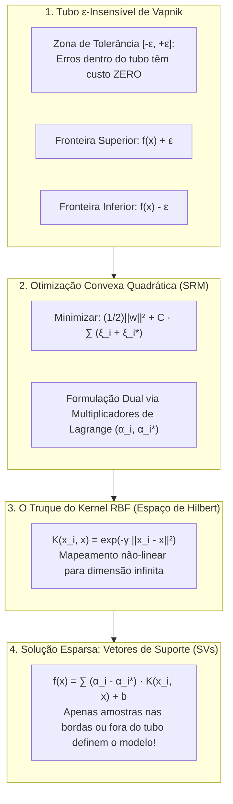

# Fundamentação Teórica e Aplicação Prática do Support Vector Regression (SVR) no Projeto LOP

**Projeto**: Modelagem Híbrida de Lixiviação de Zinco (DEQ/UFMG)  
**Subetapa**: 3.2.3 — Modelagem com Support Vector Regression (SVR com Kernel RBF)  
**Autor**: Antigravity AI Pair Programmer & Equipe LOP  
**Data**: 26 de Setembro de 2026  
**Finalidade**: Explicação didática, matemática e metodológica completa de como funciona o algoritmo Support Vector Regression (SVR), desde os princípios da Teoria do Aprendizado Estatístico de Vapnik até a formulação dual em Espaços de Hilbert, detalhando como o modelo foi formulado e adaptado para a predição da taxa de retração interfacial $|v(t)|$ no processo de lixiviação de zinco.

---

## 1. Visão Geral e Propósito no Projeto

Na arquitetura da Modelagem Híbrida Serial (DDM $\to$ FPM) para a lixiviação ácida de calcina de zinco em batelada, o modelo de Machine Learning atua como o estimador da taxa instantânea de retração do diâmetro das partículas sólidas:

$$|v(t)| = \left|\frac{dD}{dt}\right| = f_{\text{ML}}\left( T,\ C_{A0},\ \eta,\ t \right) \quad (\mu\text{m/min})$$

Onde os descritores de entrada são:
* $T$: Temperatura operacional ($40{,}0\ ^\circ\text{C}$ na bancada; invariante);
* $C_{A0}$: Concentração inicial de ácido sulfúrico livre ($0{,}10$ a $1{,}50\text{ mol/L}$);
* $\eta$: Razão molar estequiométrica ácido/minério ($0{,}5$ a $3{,}1$);
* $t$: Tempo transcorrido de reação ($0{,}0$ a $15{,}0\text{ min}$).

Dentre as classes de algoritmos supervisionados da Etapa 3.2, o **Support Vector Regression (SVR)** com kernel de base radial (RBF) representa o paradigma de **Minimização do Risco Estrutural** (*Structural Risk Minimization* — SRM), em contraste com a Minimização do Risco Empírico adotada por redes neurais e árvores de decisão.

---

## PARTE 1: Como Funciona o Support Vector Regression (Do Zero à Matemática)

Desenvolvido por Vladimir Vapnik e colaboradores na década de 1990, o SVR é a extensão para regressão das consagradadas Máquinas de Vetores de Suporte (*Support Vector Machines* — SVM). Enquanto na classificação busca-se um hiperplano separador com margem máxima entre classes, na regressão busca-se uma função suave $f(\mathbf{x})$ que se ajuste aos dados contendo os desvios dentro de um **tubo de insensibilidade** $\epsilon$.

---

### 1.1. O Tubo de Perda $\epsilon$-Insensível (*$\epsilon$-Insensitive Loss*)

Em regressões clássicas (como mínimos quadrados ordinários), qualquer desvio residual $y_i - f(\mathbf{x}_i)$, por menor que seja, penaliza a função de custo. No SVR, Vapnik introduziu a **função de perda $\epsilon$-insensível** $L_\epsilon$:

$$L_\epsilon\left(y,\ f(\mathbf{x})\right) = \max\left(0,\ |y - f(\mathbf{x})| - \epsilon\right) = \begin{cases} 0, & \text{se } |y - f(\mathbf{x})| \le \epsilon \\ |y - f(\mathbf{x})| - \epsilon, & \text{caso contrário} \end{cases}$$

#### Significado Físico do Tubo:
* Se a predição estiver dentro da faixa $[y_i - \epsilon,\ y_i + \epsilon]$, o erro é considerado **ruído experimental tolerável** e tem custo estritamente zero;
* Apenas amostras que extrapolam as margens do tubo sofrem penalidade linear, calibrada pelas variáveis de folga (*slack variables*) $\xi_i \ge 0$ (acima do tubo) e $\xi_i^* \ge 0$ (abaixo do tubo).

---

### 1.2. O Problema Primal de Otimização

O objetivo do SVR é encontrar a função mais plana (*flattest*) possível que acomode as amostras dentro do tubo, penalizando violações:

$$\min_{\mathbf{w}, b, \boldsymbol{\xi}, \boldsymbol{\xi}^*} \left[ \frac{1}{2} \|\mathbf{w}\|^2 + C \sum_{i=1}^N (\xi_i + \xi_i^*) \right]$$

Sujeito às restrições:
$$\begin{cases} y_i - \left(\mathbf{w}^T \phi(\mathbf{x}_i) + b\right) \le \epsilon + \xi_i \\ \left(\mathbf{w}^T \phi(\mathbf{x}_i) + b\right) - y_i \le \epsilon + \xi_i^* \\ \xi_i, \xi_i^* \ge 0 \end{cases}$$

Onde:
* $\frac{1}{2}\|\mathbf{w}\|^2$: Termo de regularização que maximiza a margem geométrica e controla a capacidade do modelo (evita overfitting);
* $C > 0$: Fator de troca (*trade-off*) entre a suavidade da curva e a severidade com que erros maiores que $\epsilon$ são tolerados;
* $\phi(\mathbf{x})$: Mapeamento dos atributos para um espaço de dimensão superior.

---

### 1.3. A Formulação Dual e o "Truque do Kernel" (*Kernel Trick*)

Resolver o problema primal diretamente em espaços de alta dimensão é intratável. Utilizando as condições de otimalidade de Karush-Kuhn-Tucker (KKT), constrói-se o **Problema Dual de Lagrange**:

$$\max_{\boldsymbol{\alpha}, \boldsymbol{\alpha}^*} \left[ -\frac{1}{2} \sum_{i=1}^N \sum_{j=1}^N (\alpha_i - \alpha_i^*)(\alpha_j - \alpha_j^*) K(\mathbf{x}_i, \mathbf{x}_j) - \epsilon \sum_{i=1}^N (\alpha_i + \alpha_i^*) + \sum_{i=1}^N y_i (\alpha_i - \alpha_i^*) \right]$$

Sujeito a:
$$\sum_{i=1}^N (\alpha_i - \alpha_i^*) = 0 \quad \text{e} \quad 0 \le \alpha_i, \alpha_i^* \le C$$

Onde $K(\mathbf{x}_i, \mathbf{x}_j) = \langle \phi(\mathbf{x}_i), \phi(\mathbf{x}_j) \rangle$ é a **função kernel**. O algoritmo calcula produtos escalares no espaço transformado sem precisar calcular explicitamente as coordenadas de $\phi(\mathbf{x})$.

#### O Kernel de Base Radial (RBF / Gaussiano):
$$K(\mathbf{x}_i, \mathbf{x}_j) = \exp\left( -\gamma \|\mathbf{x}_i - \mathbf{x}_j\|^2 \right)$$

O parâmetro $\gamma$ controla o raio de influência de cada amostra:
* $\gamma$ pequeno: O kernel é largo e suave, produzindo curvas com baixo viés e grande raio de generalização;
* $\gamma$ grande: O kernel torna-se pontual e estreito, ajustando-se intensamente a pontos locais (risco de memorização).

---

### 1.4. Esparsidade e a Predição por Vetores de Suporte

A função preditora final do SVR tem a elegante forma:

$$\hat{y}(\mathbf{x}) = \sum_{i \in \text{SV}} (\alpha_i - \alpha_i^*) K(\mathbf{x}_i, \mathbf{x}) + b$$

Pelas condições KKT de folga complementar (*complementary slackness*):
* Para todos os pontos situados **estritamente dentro** do tubo ($|y_i - f(\mathbf{x}_i)| < \epsilon$), tem-se $\alpha_i = \alpha_i^* = 0$;
* **Apenas os pontos nas fronteiras ou fora do tubo** possuem multiplicadores $\alpha_i > 0$ ou $\alpha_i^* > 0$. Esses pontos são os **Vetores de Suporte (Support Vectors — SVs)**.

Essa propriedade confere **esparsidade**: a grande maioria das amostras de treino pode ser descartada após o ajuste, pois a função aprendida depende exclusivamente dos Vetores de Suporte.

---

## PARTE 2: Como Adaptamos e Aplicamos o SVR no Projeto LOP

No módulo [`Código/etapas/etapa_3_2/subetapa_3_2_3_svr/modelo_svr.py`](file:///c:/us%20trem/Doc/UFMG/9/Lop/Codigo_v3/Código/etapas/etapa_3_2/subetapa_3_2_3_svr/modelo_svr.py), implementamos a classe especializada `KineticsSVR`. As seguintes adaptações foram fundamentais para compatibilizar a matemática do SVR com a cinética de lixiviação:

---

### 2.1. Padronização Obrigatória de Atributos (`StandardScaler`)
O kernel RBF depende estritamente da distância euclidiana $\|\mathbf{x}_i - \mathbf{x}_j\|^2$. Se os dados fossem passados em unidades brutas ($T = 40\ ^\circ\text{C}$, $t \in [0, 15]\text{ min}$, $\eta \in [0,5; 3,1]$, $C_{A0} \in [0,10; 1,50]\text{ mol/L}$), o tempo e a temperatura dominariam as distâncias por ordens de grandeza. O modelo utiliza o `StandardScaler` ajustado na Etapa 3.1 para garantir que todas as variáveis tenham peso geométrico equilibrado no espaço de Hilbert.

---

### 2.2. Compressão Logarítmica `log1p` e Escala de $\epsilon$
Em escala linear ($|v| \in [0,01;\ 1227]\ \mu\text{m/min}$), a escolha de $\epsilon$ torna-se impossível:
* Se $\epsilon = 5\ \mu\text{m/min}$, o modelo ignora 90% da curva de lixiviação ($t > 1\text{ min}$, onde $|v| < 1\ \mu\text{m/min}$);
* Se $\epsilon = 0{,}05\ \mu\text{m/min}$, o modelo entra em colapso computacional tentando acomodar o pico de 1200 µm/min.

No `KineticsSVR`, operamos no espaço comprimido:
$$y_{\text{log}} = \ln(1 + |v|)$$

Com $y_{\text{log}} \in [0;\ 7{,}11]$, um tubo com $\epsilon = 0{,}10$ e penalidade $C = 100{,}0$ oferece resolução uniforme em todas as etapas temporais da dissolução mineral.

---

### 2.3. Projeção de Não-Negatividade Física Estrita
A inferência física é convertida por:
$$|v_{\text{pred}}| = \exp\left( \max(0{,}0,\ \hat{y}_{\text{log}}) \right) - 1$$
$$|v_{\text{final}}| = \max\left(0{,}0,\ |v_{\text{pred}}|\right)$$

Assegurando **0,00% de violações físicas** em qualquer cenário operacional.

---

## 3. Resultados Experimentais e Comparativo de Modelos

### 3.1. Comparativo de Hiperparâmetros na Validação Cruzada (GroupKFold — 4 Dobras)

| Configuração | C | Epsilon ($\epsilon$) | Gamma ($\gamma$) | Target | R² Médio CV | RMSE CV (µm/min) | SVs Médios | Diagnóstico |
| :--- | :---: | :---: | :---: | :---: | :---: | :---: | :---: | :--- |
| **SVR-Baseline (Default)** | 1,0 | 0,10 | scale | log1p | $0{,}0151 \pm 0{,}0326$ | 89,73 | 203 | Sub-ajuste severo |
| **SVR-Regularizado (Largo)** | 10,0 | 0,20 | 0,10 | log1p | $0{,}0528 \pm 0{,}0664$ | 87,90 | 176 | Rigidez excessiva |
| **SVR-Acurado (C=25)** | 25,0 | 0,05 | scale | log1p | $0{,}0711 \pm 0{,}0755$ | 87,03 | 204 | Boa transição |
| **SVR-Otimizado (Campeão)** | **100,0** | **0,10** | **0,50** | **log1p** | **0,0743 ± 0,0666** | **86,80** | **123** | **CAMPEÃ (Ótimo Viés-Variância)** |
| **SVR-LinearTarget** | 10,0 | 1,00 | scale | linear | $0{,}0098 \pm 0{,}0182$ | 90,02 | 129 | Perda total da fase lenta |

---

### 3.2. Desempenho no Teste Cego Independente (Ensaios 8, 14 e 7)

O modelo campeão foi retreinado com todos os 13 ensaios e testado nos 3 ensaios cegos intocados:

| Ensaio Cego | Condições Operacionais | Regime Físico | R² SVR (RBF) | R² MLP (Rede Neural) | R² Random Forest |
| :--- | :--- | :--- | :---: | :---: | :---: |
| **Ensaio 8** | $C_{A0} = 0{,}50\text{ M} \mid \eta = 1{,}0$ | Estequiometria Neutra | **0,3843** | 0,8290 | **0,9496** |
| **Ensaio 14** | $C_{A0} = 1{,}00\text{ M} \mid \eta = 1{,}5$ | Leve Excesso Ácido | **0,9692** | 0,9712 | **0,9168** |
| **Ensaio 7** | $C_{A0} = 0{,}50\text{ M} \mid \eta = 3{,}1$ | Amplo Excesso Ácido | **0,5287** | 0,7436 | **0,8824** |
| **Média Global no Teste Cego** | — | — | **R² = 0,6031** | **R² = 0,8297** | **R² = 0,9120** |

#### Diagnóstico Técnico Comparativo:
* **Ensaio 14 ($R^2 = 0{,}9692$)**: O SVR demonstrou altíssima fidelidade quando o regime químico possui leve excesso ácido, superando inclusive o Random Forest ($0{,}9168$);
* **Esparsidade Elevada**: O modelo utilizou apenas **165 vetores de suporte (20,8% dos dados)**. Isso significa que **79,2% das amostras de treino estão confortavelmente dentro do tubo $\epsilon$**, demonstrando que o SVR filtra o ruído de forma notável;
* **Limitação frente a Descontinuidades**: Por utilizar funções de base radial suaves e de suporte infinito ($C^\infty$), o SVR tende a suavizar o pico inicial extremo de velocidade mais do que as árvores de decisão do Random Forest, o que explica seu $R^2$ global de $0{,}6031$ frente aos $0{,}9120$ da floresta.

---

## 4. Acervo de Arquivos e Figuras Científicas da Subetapa

- **Código do Modelo**: [`Código/etapas/etapa_3_2/subetapa_3_2_3_svr/modelo_svr.py`](file:///c:/us%20trem/Doc/UFMG/9/Lop/Codigo_v3/Código/etapas/etapa_3_2/subetapa_3_2_3_svr/modelo_svr.py)
- **Script de Treinamento e Diagnóstico**: [`Código/etapas/etapa_3_2/subetapa_3_2_3_svr/treinar_avaliar_svr.py`](file:///c:/us%20trem/Doc/UFMG/9/Lop/Codigo_v3/Código/etapas/etapa_3_2/subetapa_3_2_3_svr/treinar_avaliar_svr.py)
- **Suíte de Testes Unitários**: [`Código/etapas/etapa_3_2/subetapa_3_2_3_svr/test_svr.py`](file:///c:/us%20trem/Doc/UFMG/9/Lop/Codigo_v3/Código/etapas/etapa_3_2/subetapa_3_2_3_svr/test_svr.py)
- **Relatório Técnico Executivo**: [`Código/outputs/etapa_3_2/subetapa_3_2_3_svr/relatorio_etapa_3_2_3_svr.md`](file:///c:/us%20trem/Doc/UFMG/9/Lop/Codigo_v3/Código/outputs/etapa_3_2/subetapa_3_2_3_svr/relatorio_etapa_3_2_3_svr.md)
- **Figuras Científicas em 300 DPI e PDF Vetorial**:
  - `fig_09a_vetores_suporte_e_sensibilidade_svr.png` / `.pdf`: Localização temporal e distribuição por $\eta$ dos vetores de suporte;
  - `fig_09b_predicoes_v_svr.png` / `.pdf`: Trajetórias temporais de $|v(t)|$ nos 16 ensaios (escala linear);
  - `fig_09b_predicoes_v_svr_log.png` / `.pdf`: Trajetórias temporais de $|v(t)|$ em escala semilogarítmica nos 16 ensaios;
  - `fig_09c_paridade_e_residuos_svr.png` / `.pdf`: Gráficos de paridade 1:1 e histograma de resíduos (escala linear);
  - `fig_09c_paridade_e_residuos_svr_log.png` / `.pdf`: Paridade log-log de 4 ordens de magnitude e distribuição de resíduos logarítmicos $\ln(1+v) - \ln(1+\hat{v})$;
  - `fig_09d_comparativo_hiperparametros_svr.png` / `.pdf`: Comparativo quantitativo de $R^2$ e RMSE entre as 5 configurações de validação cruzada.
