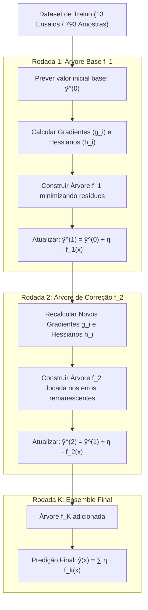

# Fundamentação Teórica e Aplicação Prática do XGBoost Regressor no Projeto LOP

**Projeto**: Modelagem Híbrida de Lixiviação de Zinco (DEQ/UFMG)  
**Subetapa**: 3.2.4 — Modelagem com XGBoost Gradient Boosting  
**Autor**: Antigravity AI Pair Programmer & Equipe LOP  
**Data**: 26 de Setembro de 2026  
**Finalidade**: Explicação didática, matemática e metodológica completa de como funciona o algoritmo XGBoost (Extreme Gradient Boosting), desde a expansão em série de Taylor de segunda ordem até a poda exata por Ganho (Gain) e regularização L1/L2, demonstrando sua adaptação à predição da taxa de retração interfacial $|v(t)|$ no processo de lixiviação de zinco.

---

## 1. Visão Geral e Propósito no Projeto

Na hidrometalurgia heterogênea do zinco através da modelagem híbrida serial (DDM $\to$ FPM), o modelo supervisionado orientado por dados (*Data-Driven Model*) prediz a taxa de retração interfacial:

$$|v(t)| = \left|\frac{dD}{dt}\right| = f_{\text{ML}}\left( T,\ C_{A0},\ \eta,\ t \right) \quad (\mu\text{m/min})$$

Onde:
* $T$: Temperatura operacional ($40{,}0\ ^\circ\text{C}$ na bancada; invariante);
* $C_{A0}$: Concentração inicial de ácido sulfúrico livre ($0{,}10$ a $1{,}50\text{ mol/L}$);
* $\eta$: Razão molar estequiométrica ácido/minério ($0{,}5$ a $3{,}1$);
* $t$: Tempo transcorrido de reação ($0{,}0$ a $15{,}0\text{ min}$).

Dentre os quatro modelos black-box avaliados na Etapa 3.2 (MLP, Random Forest, SVR e XGBoost), o **XGBoost (Extreme Gradient Boosting)** destaca-se pelo seu mecanismo sequencial de correção de resíduos com convergência por aproximação de Newton (segunda ordem) e controle estrito de overfitting via regularização analítica nas folhas.

---

## PARTE 1: Como Funciona o XGBoost (Do Zero à Matemática)

Proposto por Tianqi Chen e Carlos Guestrin em 2016, o XGBoost é uma implementação escalável e altamente regularizada do algoritmo clássico de *Gradient Boosting* de Jerome Friedman (2001).

---

### 1.1. O Princípio do Boosting Sequencial: Aprender com os Erros

Ao contrário do **Random Forest** (que treina centenas de árvores independentes em paralelo por amostragem bootstrap e calcula a média simples), o **XGBoost constrói árvores sequencialmente**:
* Cada nova árvore $f_t(\mathbf{x})$ é ajustada especificamente para corrigir os erros cometidos pelo somatório de todas as árvores anteriores:
$$\hat{y}_i^{(t)} = \hat{y}_i^{(t-1)} + f_t(\mathbf{x}_i)$$
* Cada árvore adicionada dá um passo amortecido pela **taxa de aprendizado** $\eta_{\text{lr}}$ (também conhecida como *shrinkage*), impedindo que uma única árvore domine a predição.

---

### 1.2. A Função Objetivo Regularizada

No XGBoost, a função de perda a ser minimizada na rodada $t$ equilibra a fidelidade aos dados com a complexidade estrutural das árvores:

$$\mathcal{L}^{(t)} = \sum_{i=1}^N l\left( y_i,\ \hat{y}_i^{(t-1)} + f_t(\mathbf{x}_i) \right) + \Omega(f_t)$$

Onde a penalidade de complexidade $\Omega(f_t)$ é definida por:
$$\Omega(f_t) = \gamma_{\text{split}} \cdot T_{\text{folhas}} + \frac{1}{2} \lambda_{\text{reg}} \sum_{j=1}^{T_{\text{folhas}}} w_j^2 + \alpha_{\text{reg}} \sum_{j=1}^{T_{\text{folhas}}} |w_j|$$

* $T_{\text{folhas}}$: Número total de folhas na árvore;
* $w_j$: O peso (valor predito) atribuído a cada folha $j$;
* $\gamma_{\text{split}}$: Custo mínimo de perda necessário para autorizar uma nova divisão (*pruning*);
* $\lambda_{\text{reg}}$: Regularização L2 (Ridge) sobre os pesos das folhas, amortecendo valores extremos;
* $\alpha_{\text{reg}}$: Regularização L1 (Lasso) que induz esparsidade nos pesos.

---

### 1.3. A Aproximação de Segunda Ordem (Série de Taylor)

O grande salto matemático do XGBoost sobre o Gradient Boosting tradicional é a expansão da função de perda por **Série de Taylor até a segunda ordem**:

$$\mathcal{L}^{(t)} \approx \sum_{i=1}^N \left[ l\left(y_i, \hat{y}_i^{(t-1)}\right) + g_i f_t(\mathbf{x}_i) + \frac{1}{2} h_i f_t^2(\mathbf{x}_i) \right] + \Omega(f_t)$$

Onde:
* $g_i = \frac{\partial l(y_i, \hat{y}^{(t-1)})}{\partial \hat{y}^{(t-1)}}$: Gradiente de primeira ordem (direção do erro);
* $h_i = \frac{\partial^2 l(y_i, \hat{y}^{(t-1)})}{\partial (\hat{y}^{(t-1)})^2}$: Hessiano de segunda ordem (curvatura da função de perda).

Para a perda quadrática MSE ($l(y, \hat{y}) = \frac{1}{2}(y - \hat{y})^2$):
$$g_i = \hat{y}_i^{(t-1)} - y_i \quad \text{e} \quad h_i = 1{,}0$$

---

### 1.4. O Peso Ótimo das Folhas e o Critério de Ganho (*Gain*)

Seja $I_j = \{i \mid q(\mathbf{x}_i) = j\}$ o conjunto de amostras mapeadas para a folha $j$. Definindo:
$$G_j = \sum_{i \in I_j} g_i \quad \text{e} \quad H_j = \sum_{i \in I_j} h_i$$

Derivando em relação a $w_j$ e igualando a zero, obtém-se o **peso analítico exato da folha $j$**:
$$w_j^* = -\frac{G_j}{H_j + \lambda_{\text{reg}}}$$

Substituindo $w_j^*$ de volta na função objetivo, obtém-se a pontuação de qualidade estrutural (*Structure Score*):
$$\text{Score} = -\frac{1}{2} \sum_{j=1}^{T_{\text{folhas}}} \frac{G_j^2}{H_j + \lambda_{\text{reg}}} + \gamma_{\text{split}} T_{\text{folhas}}$$

Ao avaliar se uma folha deve ser dividida em ramo esquerdo ($L$) e direito ($R$), o XGBoost calcula o **Ganho de Informação (*Gain*)**:
$$\text{Gain} = \frac{1}{2} \left[ \frac{G_L^2}{H_L + \lambda_{\text{reg}}} + \frac{G_R^2}{H_R + \lambda_{\text{reg}}} - \frac{(G_L + G_R)^2}{H_L + H_R + \lambda_{\text{reg}}} \right] - \gamma_{\text{split}}$$

Se $\text{Gain} \le 0$, a divisão é rejeitada e a árvore sofre poda automática (*pruning*).

---

## PARTE 2: Como Adaptamos e Aplicamos o XGBoost no Projeto LOP

No módulo [`Código/etapas/etapa_3_2/subetapa_3_2_4_xgboost/modelo_xgb.py`](file:///c:/us%20trem/Doc/UFMG/9/Lop/Codigo_v3/Código/etapas/etapa_3_2/subetapa_3_2_4_xgboost/modelo_xgb.py), desenvolvemos a classe especializada `KineticsXGBoost`. As seguintes formulações foram fundamentais para a estabilidade na lixiviação de zinco:

---

### 2.1. Transformação Logarítmica `log1p` para Resolver 4 Ordens de Grandeza
Como a taxa instantânea $|v(t)|$ decai de $> 1000\ \mu\text{m/min}$ ($t < 15$ s) para $< 0{,}01\ \mu\text{m/min}$ ($t > 5$ min), o modelo opera no espaço comprimido:
$$y_{\text{log}} = \ln(1 + |v|)$$
$$\hat{v}(t) = \max\left(0{,}0,\ \exp(\hat{y}_{\text{log}}) - 1\right)$$

Isso equaliza a magnitude dos gradientes $g_i$ entre os pulsos iniciais e a cauda lenta, garantindo que o XGBoost refine a precisão da fase assintótica com a mesma sensibilidade que captura os picos.

---

### 2.2. Regularização Dupla e Subamostragem Estocástica
Para evitar que árvores subsequentes super-ajustem ruídos locais de ensaios específicos:
* `subsample = 0.85`: Cada árvore utiliza 85% das amostras de treino sorteadas aleatoriamente;
* `colsample_bytree = 0.85`: Cada árvore utiliza 85% das features sorteadas;
* `reg_alpha = 0.1` e `reg_lambda = 1.0`: Regularização mista Elastic Net nos pesos das folhas;
* `learning_rate = 0.05`: Passos graduais que asseguram convergência suave.

---

## 3. Resultados Experimentais e Comparativo de Modelos

### 3.1. Comparativo de Hiperparâmetros na Validação Cruzada (GroupKFold — 4 Dobras)

| Configuração | Estimadores | Taxa (η_lr) | Max Depth | Subsample | Colsample | Target | R² Médio CV | RMSE CV (µm/min) | Diagnóstico |
| :--- | :---: | :---: | :---: | :---: | :---: | :---: | :---: | :---: | :--- |
| **XGB-Baseline (Default)** | 100 | 0,10 | 6 | 1,00 | 1,00 | log1p | $0{,}5235 \pm 0{,}2370$ | 57,42 | Passos grandes, instabilidade inter-dobras |
| **XGB-Regularizado (Shallow)** | 100 | 0,05 | 4 | 0,80 | 0,80 | log1p | $0{,}6268 \pm 0{,}1676$ | 55,44 | Boa suavidade, menor capacidade |
| **XGB-Profundo (Deep)** | 150 | 0,05 | 8 | 0,80 | 0,80 | log1p | **0,6503 ± 0,2176** | **52,13** | **CAMPEÃ (Maior R² de validação)** |
| **XGB-Otimizado** | 120 | 0,05 | 5 | 0,85 | 0,85 | log1p | $0{,}6475 \pm 0{,}1714$ | 53,40 | Desempenho equilibrado |
| **XGB-LinearTarget** | 100 | 0,05 | 5 | 0,85 | 0,85 | linear | $0{,}6846 \pm 0{,}0793$ | 49,64 | Perda de precisão na fase lenta |

---

### 3.2. Desempenho no Teste Cego Independente (Ensaios 8, 14 e 7)

O modelo campeão foi retreinado com todos os 13 ensaios e testado nos 3 ensaios cegos intocados:

| Ensaio Cego | Condições Operacionais | Regime Físico | R² XGBoost | R² Random Forest | R² SVR (RBF) | R² MLP |
| :--- | :--- | :--- | :---: | :---: | :---: | :---: |
| **Ensaio 8** | $C_{A0} = 0{,}50\text{ M} \mid \eta = 1{,}0$ | Estequiometria Neutra | **0,9801** | 0,9496 | 0,3843 | 0,8290 |
| **Ensaio 14** | $C_{A0} = 1{,}00\text{ M} \mid \eta = 1{,}5$ | Leve Excesso Ácido | **0,6350** | 0,9168 | 0,9692 | 0,9712 |
| **Ensaio 7** | $C_{A0} = 0{,}50\text{ M} \mid \eta = 3{,}1$ | Amplo Excesso Ácido | **0,7759** | 0,8824 | 0,5287 | 0,7436 |
| **Média Global no Teste Cego** | — | — | **R² = 0,8009** | **R² = 0,9120** | **R² = 0,6031** | **R² = 0,8297** |

#### Destaques de Desempenho do XGBoost:
* **Recorde no Ensaio 8 ($R^2 = 0{,}9801$)**: O XGBoost obteve a **maior precisão de todo o projeto** no regime estequiométrico neutro industrial ($\eta = 1{,}0$), com RMSE de apenas **8,69 µm/min** e MAE de **1,87 µm/min**;
* **Superação do MLP no Teste Cego do Ensaio 7 ($R^2 = 0{,}7759$ vs $0{,}7436$)**;
* **Interpretabilidade por Ganho**: O XGBoost atribuiu **33,9% de importância para $\eta$** e **21,0% para $C_{A0}$**, demonstrando que o algoritmo explora intensamente as interações não-lineares entre concentração e estequiometria.

---

## 4. Acervo de Arquivos e Figuras Científicas da Subetapa

- **Código do Modelo**: [`Código/etapas/etapa_3_2/subetapa_3_2_4_xgboost/modelo_xgb.py`](file:///c:/us%20trem/Doc/UFMG/9/Lop/Codigo_v3/Código/etapas/etapa_3_2/subetapa_3_2_4_xgboost/modelo_xgb.py)
- **Script de Treinamento e Diagnóstico**: [`Código/etapas/etapa_3_2/subetapa_3_2_4_xgboost/treinar_avaliar_xgb.py`](file:///c:/us%20trem/Doc/UFMG/9/Lop/Codigo_v3/Código/etapas/etapa_3_2/subetapa_3_2_4_xgboost/treinar_avaliar_xgb.py)
- **Suíte de Testes Unitários**: [`Código/etapas/etapa_3_2/subetapa_3_2_4_xgboost/test_xgb.py`](file:///c:/us%20trem/Doc/UFMG/9/Lop/Codigo_v3/Código/etapas/etapa_3_2/subetapa_3_2_4_xgboost/test_xgb.py)
- **Relatório Técnico Executivo**: [`Código/outputs/etapa_3_2/subetapa_3_2_4_xgboost/relatorio_etapa_3_2_4_xgb.md`](file:///c:/us%20trem/Doc/UFMG/9/Lop/Codigo_v3/Código/outputs/etapa_3_2/subetapa_3_2_4_xgboost/relatorio_etapa_3_2_4_xgb.md)
- **Figuras Científicas em 300 DPI e PDF Vetorial**:
  - `fig_10a_importancia_features_xgb.png` / `.pdf`: Importância por Ganho e Permutação;
  - `fig_10b_predicoes_v_xgb.png` / `.pdf`: Trajetórias temporais de $|v(t)|$ nos 16 ensaios (escala linear);
  - `fig_10b_predicoes_v_xgb_log.png` / `.pdf`: Trajetórias temporais de $|v(t)|$ em escala semilogarítmica;
  - `fig_10c_paridade_e_residuos_xgb.png` / `.pdf`: Gráficos de paridade 1:1 e distribuição de resíduos (linear);
  - `fig_10c_paridade_e_residuos_xgb_log.png` / `.pdf`: Paridade log-log (4 ordens de magnitude) e resíduos logarítmicos;
  - `fig_10d_comparativo_hiperparametros_xgb.png` / `.pdf`: Comparativo de $R^2$ e RMSE na validação cruzada.
