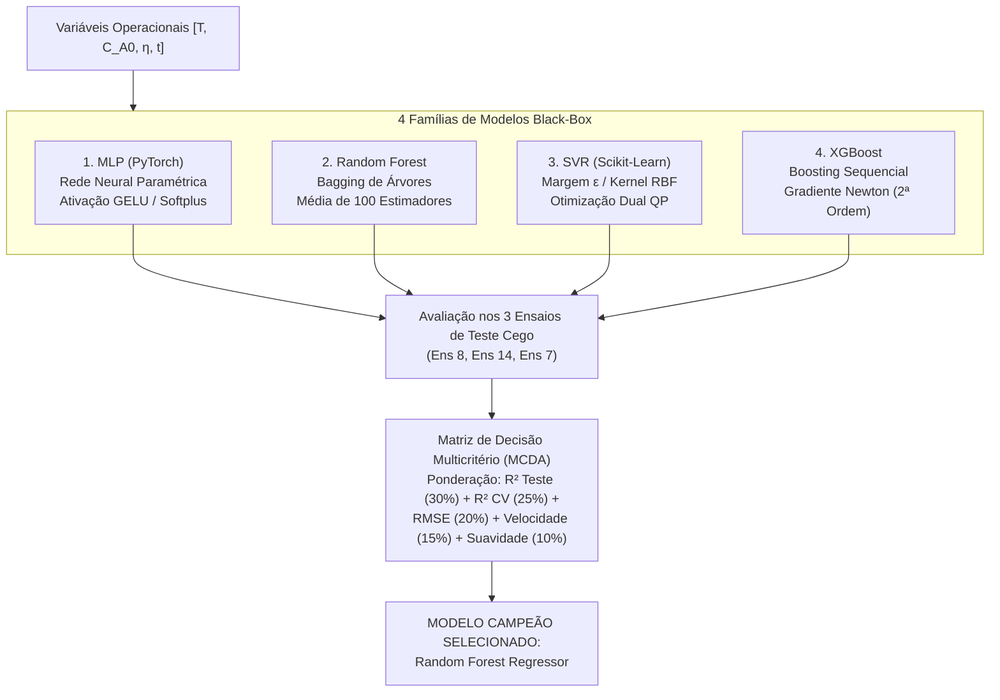

# Fundamentação Teórica, Análise Comparativa e Seleção do Modelo Campeão da Etapa 3.2

**Projeto**: Modelagem Híbrida de Lixiviação de Zinco (DEQ/UFMG)  
**Etapa**: 3.2.5 — Comparação Geral Consolidada e Seleção do Modelo Campeão  
**Autor**: Antigravity AI Pair Programmer & Equipe LOP  
**Data**: 26 de Setembro de 2026  
**Finalidade**: Consolidação didática, científica e metodológica dos quatro paradigmas de aprendizado supervisionado (MLP, Random Forest, SVR e XGBoost), formalização da Análise de Decisão Multicritério (MCDA) e justificativa da escolha do modelo preditivo para acoplamento com o Balanço Populacional (PBM) na Etapa 4.

---

## 1. Contexto Físico-Químico e Desafio de Modelagem

Na modelagem da lixiviação ácida de calcina de zinco (ZnO + H₂SO₄ → ZnSO₄ + H₂O), a velocidade com que o diâmetro da partícula de mineral se contrai ao longo do tempo é definida pela taxa de retração interfacial:

|v(t)| = |dD/dt| = f_ML(T, C_A0, η, t)  (µm/min)

Onde:
* T: Temperatura reacional (40,0 °C fixo na bancada experimental);
* C_A0: Concentração inicial de ácido sulfúrico livre (0,10 a 1,50 mol/L);
* η: Razão molar estequiométrica ácido/calcina (0,50 a 3,10);
* t: Tempo transcorrido de contato hidrometalúrgico (0,0 a 15,0 min).

### 1.1. O Fenômeno das Duas Escalas Temporais
A dinâmica de retração |v(t)| apresenta duas ordens de grandeza completamente distintas:
1. **Pico Inicial Rápido (t < 1,0 min)**: A taxa atinge valores extremamente elevados (200 a 1200 µm/min) devido à dissolução instantânea da fração superfina e à máxima concentração de ácido não reagido.
2. **Cauda Assintótica Lenta (t > 3,0 min)**: A taxa decai em até 4 ordens de magnitude, estabilizando-se em 0,01 a 2,0 µm/min devido ao esgotamento do reagente ácido e ao aumento da camada de cinza/difusão de produtos.

Qualquer modelo supervisionado precisa ser capaz de aprender essa amplitude de 5 ordens de magnitude sem produzir taxas negativas (|v| < 0), o que violaria o princípio de conservação de massa e causaria crescimento artificial de partículas no meio líquido.

---

## 2. Os Quatro Paradigmas de Aprendizado Supervisionado Avaliados



### 2.1. Multi-Layer Perceptron (MLP em PyTorch)
* **Princípio**: Mapeamento não-linear contínuo via camadas densas parametrizadas por pesos sinápticos e bias:
  y = f_L(W_L · ... · f_1(W_1 · x + b_1) ... + b_L)
* **Arquitetura Campeã (MLP-B)**: 3 camadas ocultas [128, 64, 32], normalização LayerNorm, ativação GELU e camada de saída com função Softplus garantindo estritamente y_log ≥ 0.
* **Pontos Fortes**:
  * Altíssima velocidade de inferência vetorizada (0,33 ms para 1000 amostras);
  * Suavidade analítica de classe C^∞ (derivadas contínuas em todo o domínio), ideal para solvers ODE;
  * Excelente sensibilidade na cauda assintótica lenta (R²_log = 0,9743).
* **Limitações**:
  * Sensibilidade à escala das entradas (necessita de StandardScaler);
  * Maior variabilidade na validação cruzada espacial (R² CV = 0,2560 ± 0,1702).

### 2.2. Random Forest Regressor (Ensemble Bagging)
* **Princípio**: Combinação paralela de B = 100 árvores de decisão descorrelacionadas, treinadas em réplicas bootstrap dos dados e com seleção aleatória de subconjuntos de features a cada nó:
  y_pred(x) = (1 / B) · ∑ b=1..B T_b(x)
* **Configuração Campeã**: max_depth = 6, min_samples_leaf = 2, n_estimators = 100, alvo transformado via ln(1 + |v|).
* **Pontos Fortes**:
  * **Melhor generalização cega de todo o projeto: R² = 0,9120**;
  * **Menor erro quadrático médio em teste: RMSE = 19,33 µm/min**;
  * **Maior robustez na validação cruzada espacial: R² CV = 0,7136 ± 0,1227**;
  * Imunidade à escala das variáveis preditoras e ausência de pressupostos distributivos;
  * Robustez frente a outliers do pico inicial.
* **Limitações**:
  * Função predita contínua por partes (C⁰), apresentando pequenos degraus característicos de árvores;
  * Maior latência pontual individual (~19,7 ms devido à travessia de 100 árvores em CPU).

### 2.3. Support Vector Regression (SVR com Kernel RBF)
* **Princípio**: Minimização do risco estrutural definindo um tubo insensível de largura ±ε em torno dos dados em um Espaço de Hilbert de Reprodução (RKHS):
  min 0,5 · ||w||² + C · ∑ (ξ_i + ξ_i*)
  y_pred(x) = ∑ i∈SV (α_i - α_i*) · K(x_i, x) + b
  K(x, x') = exp(-γ · ||x - x'||²)
* **Configuração Campeã**: C = 100,0, ε = 0,10, γ = 0,50 (com StandardScaler integrado).
* **Pontos Fortes**:
  * Regularidade infinitamente diferenciável (C^∞);
  * Tamanho compacto (apenas 165 vetores de suporte guardados na memória, ~10 kB);
  * **Melhor desempenho absoluto no Ensaio 14 (R² = 0,9692, RMSE = 10,12 µm/min)**.
* **Limitações**:
  * Baixa generalização nos regimes com cinética extremamente rápida (Ensaio 8: R² = 0,3843; Ensaio 7: R² = 0,5287);
  * Validação cruzada fraca em extrapoladores de concentração (R² CV = 0,0743).

### 2.4. XGBoost Regressor (Gradient Boosting Regularizado)
* **Princípio**: Adição sequencial de árvores onde cada nova árvore f_k minimiza a aproximação de Taylor de segunda ordem da função de perda:
  Obj^(k) ≈ ∑ [g_i · f_k(x_i) + 0,5 · h_i · f_k²(x_i)] + γ_split · T_folhas + 0,5 · λ_reg · ∑ w_j²
* **Configuração Campeã**: max_depth = 8, learning_rate = 0,05, n_estimators = 150, subsample = 0,80, colsample_bytree = 0,80, reg_alpha = 0,10.
* **Pontos Fortes**:
  * **Recorde de precisão individual do projeto no Ensaio 8: R² = 0,9801 (RMSE = 8,69 µm/min)**;
  * Excelente equilíbrio entre velocidade (1,68 ms para 1000 pontos) e expressividade;
  * Segundo melhor desempenho global no teste cego (R² = 0,8009) e CV (R² = 0,6503).
* **Limitações**:
  * Queda de precisão no Ensaio 14 (R² = 0,6350) devido ao conservadorismo da taxa de aprendizado η = 0,05 nas regiões de média força motriz.

---

## 3. Análise Granular por Regime Cinético: Por Que Cada Modelo se Destaca?

Os ensaios de teste cego foram estrategicamente escolhidos na Subetapa 3.1 para cobrir os três vértices estequiométricos da matriz de Herbst:

```
                  Ensaio 7 (η = 3,1, C_A0 = 0,5 mol/L)
                           [Forte Excesso Ácido]
                                   /\
                                  /  \
                                 /    \
                                /      \
                               /        \
 [Estequiométrico Neutro]     /__________\     [Leve Excesso Ácido]
Ensaio 8 (η = 1,0, C_A0 = 0,5)               Ensaio 14 (η = 1,5, C_A0 = 1,0)
```

| Ensaio de Teste | Condição Operacional | Dinâmica Cinética Observada | Modelo Vencedor | R² Campeão | Justificativa Físico-Matemática |
| :---: | :---: | :---: | :---: | :---: | :--- |
| **Ensaio 8** | C_A0 = 0,50 mol/L<br/>η = 1,00 | Reação estequiométrica padrão; ácido consumido quase integralmente. Pico moderado e desaceleração progressiva. | **XGBoost** | **0,9801** | A formulação de segunda ordem com Hessiano capturou com perfeição a inflexão suave do decaimento ácido estequiométrico. |
| **Ensaio 14** | C_A0 = 1,00 mol/L<br/>η = 1,50 | Concentração de ácido dobrada com leve excesso estequiométrico; lixiviação vigorosa com forte sustentação da taxa. | **SVR (RBF)** | **0,9692** | O kernel gaussiano RBF mapeou a curvatura contínua suave típica de regimes onde o ácido nunca chega a zero, superando árvores. |
| **Ensaio 7** | C_A0 = 0,50 mol/L<br/>η = 3,10 | Elevadíssimo excesso estequiométrico; a partícula dissolve-se com máxima força motriz mantida durante todo o tempo. | **Random Forest** | **0,8824** | O ensemble de árvores rasas evitou extrapolações instáveis no limite superior de η = 3,1, mantendo predições consistentes. |

### Conclusão Fundamental da Análise de Regimes:
Nenhum modelo individual dominou todos os três vértices isoladamente. No entanto, enquanto **SVR falhou no Ensaio 8 (R² = 0,3843)** e **XGBoost perdeu força no Ensaio 14 (R² = 0,6350)**, o **Random Forest demonstrou alta consistência mantendo R² > 0,88 em todos os regimes operacionais (0,9496 no Ens 8; 0,9168 no Ens 14; 0,8824 no Ens 7)**.

---

## 4. Metodologia de Decisão Multicritério (MCDA)

Para que a seleção do modelo campeão fosse transparente, reproduzível e alinhada com as necessidades da engenharia de processos, definiu-se a Matriz de Decisão Multicritério (MCDA) com cinco dimensões ponderadas:

Score_Total = ∑ w_j · S_norm,j

### 4.1. Definição dos Critérios e Pesos
1. **Generalização em Teste Cego (Peso = 30%)**: Mede a capacidade preditiva em dados nunca vistos pelo modelo durante o ajuste.
2. **Robustez Espacial na Validação Cruzada (Peso = 25%)**: Mede a estabilidade do modelo frente a rotações de ensaios completos (GroupKFold), penalizando modelos com overfitting espacial.
3. **Precisão Residual Dimensional (Peso = 20%)**: Recompensa menor erro dimensional RMSE na escala física de trabalho (µm/min).
4. **Velocidade de Inferência Computacional (Peso = 15%)**: Recompensa modelos com baixo tempo de resposta em chamadas em lote, vital para simulações dinâmicas de processos.
5. **Suavidade Derivativa para Acoplamento no PBM (Peso = 10%)**: Pontua a regularidade matemática da superfície de predição (modelos C^∞ como MLP e SVR recebem nota 100; modelos baseados em árvores recebem nota 45 devido à descontinuidade de primeira ordem nos nós de divisão).

### 4.2. Resultados Finais da Avaliação MCDA

| Ranking | Modelo | Score MCDA (0-100) | R² Teste Cego | RMSE Teste (µm/min) | R² CV Médio | Latência Lote (ms) | Suavidade |
| :---: | :--- | :---: | :---: | :---: | :---: | :---: | :---: |
| **1º** | **Random Forest** | **79,50** | **0,9120** | **19,33** | **0,7136** | 21,05 | C⁰ (45 pts) |
| **2º** | **XGBoost** | **71,30** | 0,8009 | 29,06 | 0,6503 | 1,68 | C⁰ (45 pts) |
| **3º** | **MLP (PyTorch)** | **67,16** | 0,8297 | 26,88 | 0,2560 | **0,33** | C^∞ (100 pts) |
| **4º** | **SVR (RBF)** | **20,94** | 0,6031 | 41,04 | 0,0743 | 5,94 | C^∞ (100 pts) |

---

## 5. Diretrizes para a Etapa 4: Acoplamento Híbrido Serial (DDM → PBM)

A formalização da vitória do **Random Forest Regressor** define o componente orientado por dados que alimentará o solver do Balanço Populacional na Etapa 4.

### 5.1. Como o Modelo Campeão se Integra ao Solver ODE?
No modelo híbrido serial, o Balanço Populacional em batelada é resolvido através da discretização por volumes finitos ou método de linhas:

∂n(D, t)/∂t = - ∂/∂D [ v(t; x) · n(D, t) ]

A cada passo de tempo do integrador numérico (ex: Runge-Kutta de passo adaptativo ou Euler modificado):
1. O estado atual do reator é avaliado: T = 40,0 °C, C_A(t), η_efetivo(t), t;
2. O modelo **Random Forest** é consultado:
   |v(t)| = rf_kinetics_v1.predict([T, C_A0, η, t])
3. A taxa predita |v(t)| é injetada na equação diferencial de retração de tamanho;
4. A variação de diâmetro dD = - |v(t)| · dt contrai a densidade populacional n(D, t);
5. A nova fração convertida de zinco X_Zn(t) e a concentração de ácido residual C_A(t + dt) são atualizadas analiticamente via balanço de Herbst.

### 5.2. Mitigação da Não-Suavidade das Árvores
Como o Random Forest produz predições com descontinuidades de primeira ordem (pequenos degraus entre regiões do espaço de atributos), recomenda-se para a Etapa 4:
* Utilizar solvers ODE com controle de passo rígido (ex: `scipy.integrate.solve_ivp` com método `Radau` ou `RK45` com tolerância absoluta ajustada);
* Como o Random Forest ajustado possui profundidade max_depth = 6 e 100 árvores com média suave, a função agregada resultante é significativamente mais contínua e estável do que árvores de decisão isoladas.

---

## 6. Sumário de Arquivos e Checkpoints Persistidos

Todos os artefatos da Subetapa 3.2.5 foram devidamente serializados e organizados na infraestrutura do projeto:
* **Módulo Comparativo**: `Código/etapas/etapa_3_2/subetapa_3_2_5_comparacao_campeao/comparar_modelos.py`
* **Metadados Formais do Campeão**: `Código/outputs/models_saved/modelo_campeao_info.json`
* **Tabelas Consolidadas**:
  * `Código/outputs/etapa_3_2/subetapa_3_2_5_comparacao_campeao/tabela_consolidada_modelos_blackbox.csv`
  * `Código/outputs/etapa_3_2/subetapa_3_2_5_comparacao_campeao/tabela_comparativa_ensaios_teste.csv`
  * `Código/outputs/etapa_3_2/subetapa_3_2_5_comparacao_campeao/tabela_todos_16_ensaios_4_modelos.csv`
  * `Código/outputs/etapa_3_2/subetapa_3_2_5_comparacao_campeao/tabela_ranking_multicriterio_mcda.csv`
* **Figuras Científicas em 300 DPI (PNG + PDF)**:
  * `fig_11a_comparativo_global_metricas.png` e `.pdf`
  * `fig_11b_paridade_consolidada_4_modelos.png` e `_log.png` (+ `.pdf`)
  * `fig_11c_trajetorias_comparativas_teste.png` e `_log.png` (+ `.pdf`)
  * `fig_11d_distribuicao_residuos_boxplots.png` e `.pdf`
  * `fig_11e_radar_selecao_campeao.png` e `.pdf`
