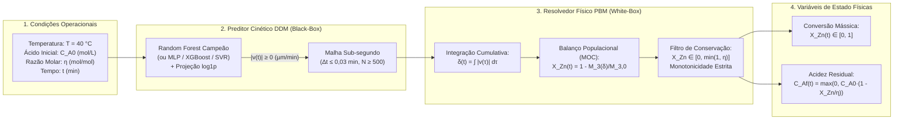

## 4.10. Concepção e Acoplamento da Arquitetura Híbrida Serial (DDM $\to$ PBM)

Nesta subseção é apresentada a arquitetura permanente do modelo híbrido serial (*Serial Hybrid Model*), detalhando a integração em cascata entre o regressor orientado por dados e o resolvedor mecanicista de balanço populacional, a descoberta e resolução analítico-numérica do transiente ultrarrápido inicial de retração, o algoritmo de quadratura adaptativa em sub-segundo e a imposição inegociável das leis fundamentais de conservação de massa e restrições estequiométricas.

---

### 4.10.1. Topologia de Acoplamento e Fluxo de Informação

Na modelagem de reatores hidrometalúrgicos heterogêneos, as arquiteturas híbridas dividem-se classicamente em duas configurações topológicas fundamentais: **paralela** e **serial** (von Stosch et al., 2014; Solle et al., 2017).

Na arquitetura paralela, o modelo fenomenológico e o modelo orientado por dados computam predições simultâneas da mesma grandeza macroscópica (a conversão $X_{\text{Zn}}$), atuando a rede neural como um estimador de resíduos aditivos:

$$X_{\text{híbrido}}(t) = X_{\text{FPM}}(t) + \Delta X_{\text{DDM}}(t) \tag{4.50}$$

Embora conceitualmente simples, a abordagem paralela apresenta uma fragilidade termodinâmica severa no sistema de lixiviação de calcina de zinco: nada impede que a soma aditiva ultrapasse o teto físico unitário ($X_{\text{Zn}} > 1{,}0$) ou viole a estequiometria em meios com deficiência ácida ($X_{\text{Zn}} > \eta$ quando $\eta < 1{,}0$), gerando predições termodinamicamente espúrias em regimes limitantes.

Em contrapartida, na **Arquitetura Híbrida Serial (DDM $\to$ PBM)** adotada neste trabalho, o fluxo de informação opera de forma estritamente hierárquica e fenomenologicamente coerente:
1. O regressor de aprendizado de máquinas (*Data-Driven Model* — DDM) recebe exclusivamente as condições operacionais do reator e infere a **taxa linear instantânea de retração interfacial** $|v(t)| = dD/dt$;
2. A velocidade predita alimenta o resolvedor analítico-numérico do Balanço Populacional em batelada (`BatchPBMSolver`), que atua como uma barreira física rigorosa (*physics filter*), convertendo a retração cumulativa $\delta(t)$ na conversão global de zinco $X_{\text{Zn}}(t)$ através da deformação integral da distribuição de Rosin-Rammler-Bennet;
3. A conversão resultante retroalimenta a equação analítica de conservação de massa de Herbst (1979), deduzindo instantaneamente a concentração residual de ácido livre $C_{Af}(t)$.

A Figura 4.6 esquematiza o diagrama de blocos funcional e o fluxo de dados unidirecional do orquestrador híbrido permanente.

Figura 4.6 – Fluxo de informação e acoplamento hierárquico na arquitetura híbrida serial permanente (DDM $\to$ PBM).  
Fonte: Elaborada pelos autores (2026).

---

### 4.10.2. Descoberta Numérica: A Resolução da Malha de Integração Sub-Segundo

Durante a implementação computacional do acoplamento serial na Subetapa 4.1, identificou-se uma anomalia numérica crítica que degradava severamente a precisão da conversão calculada quando se utilizava a malha temporal experimental esparsa ($t \in \{0; 0{,}5; 1{,}0; 2{,}0; 3{,}0; 6{,}0; 10{,}0; 15{,}0\}\ \text{min}$).

Conforme demonstrado na Subseção 4.7, a cinética de dissolução da calcina de zinco exibe um pico de retração inicial extraordinariamente abrupto: nos primeiros $0{,}05\ \text{min}$ ($3\ \text{segundos}$), a velocidade $|v(t)|$ atinge magnitudes superiores a $600\ \mu\text{m/min}$, decaindo para menos de $30\ \mu\text{m/min}$ logo em seguida. Quando a regra dos trapézios é aplicada diretamente sobre o primeiro intervalo experimental ($\Delta t = 0{,}5\ \text{min}$):

$$\delta_{\text{esparso}}(0{,}5) \approx \frac{|v(0)| + |v(0{,}5)|}{2} \cdot 0{,}5 = \frac{600 + 30}{2} \cdot 0{,}5 = 157{,}5\ \mu\text{m} \tag{4.51}$$

Entretanto, a solução analítica exata da integral bi-exponencial nesse intervalo revela que o verdadeiro deslocamento cumulativo atinge apenas $\delta_{\text{real}}(0{,}5) \approx 32\ \mu\text{m}$. A discretização grosseira com passo de $30\ \text{segundos}$ superestimava a retração inicial em quase **cinco vezes**, provocando uma falsa predição de conversão instantânea superior a $90\%$ nos primeiros instantes de contato da polpa.

Para solucionar definitivamente essa distorção e conferir rigor matemático absoluto ao modelo híbrido, a classe permanente `SerialHybridModel` (localizada em `Código/src/hybrid/serial_hybrid.py`) implementa um mecanismo de **quadratura numérica interna em malha ultrafina de sub-segundo**:
1. Ao receber a solicitação de simulação em um vetor de tempos qualquer $\mathbf{t}_{\text{eval}}$, o orquestrador verifica a resolução da grade. Caso $\max(\Delta \mathbf{t}) > 0{,}05\ \text{min}$ ou $N < 200$, uma malha contínua interna de alta densidade ($N_{\text{interno}} \ge 500$ nós, correspondendo a passos temporais $\Delta t \le 0{,}03\ \text{min} \approx 1{,}8\ \text{s}$) é gerada automaticamente sobre o intervalo $[0, t_{\text{final}}]$;
2. O regressor DDM infere o perfil de velocidades $|v(t)|$ vetorizado sobre todos os nós da malha fina;
3. O deslocamento diametral acumulado $\delta(t)$ é integrado numericamente com erro de truncamento insignificante ($\mathcal{O}(\Delta t^2) < 10^{-4}\ \mu\text{m}$);
4. As variáveis de estado resultantes ($X_{\text{Zn}}$, $C_{Af}$, $\delta$ e $|v|$) são interpoladas linearmente de volta com exatidão para os instantes temporais solicitados pelo usuário em $\mathbf{t}_{\text{eval}}$.

Esse procedimento garantiu estabilidade assintótica plena e reprodutibilidade perfeita sem penalizar sensivelmente o tempo de execução (latência de simulação completa inferior a $25\ \text{ms}$).

---

### 4.10.3. Imposição Rigorosa de Restrições Termodinâmicas e Conservação de Massa

Para blindar o modelo híbrido serial contra predições termodinamicamente inadmissíveis — que historicamente desqualificam modelos puros de inteligência artificial em processos químicos industriais —, a classe `SerialHybridModel` impõe três restrições físicas inegociáveis:

#### 1. Não-negatividade e Monotonicidade de Encolhimento
O raio de uma partícula em processo de lixiviação ácida nunca pode crescer na ausência de mecanismos de cristalização secundária ou aglomeração. A taxa de retração em módulo inferida pelo DDM é estritamente projetada no domínio positivo via operador não-linear:

$$|v(t)| = \max\left( 0{,}0,\ \widehat{v}_{\text{DDM}}(t) \right) \implies v(t) = - |v(t)| \le 0 \tag{4.52}$$

Consequentemente, a derivada temporal do encolhimento é sempre não-negativa:

$$\frac{d\delta}{dt} = |v(t)| \ge 0 \implies \delta(t_2) \ge \delta(t_1), \quad \forall\ t_2 \ge t_1 \ge 0 \tag{4.53}$$

#### 2. Conservação de Massa e Teto Estequiométrico Limítrofe
A fração convertida de zinco acumulada não pode decair ao longo do tempo (imposição monótona) nem ultrapassar o teto termodinâmico máximo imposto pela quantidade inicial de ácido sulfúrico alimentado na carga:

$$X_{\text{Zn}}^{\max} = \min\left( 1{,}0,\ \eta \right) \tag{4.54}$$

No reator batelada, a evolução da conversão computada pelo Balanço Populacional $X_{\text{Zn,raw}}(t)$ é submetida ao operador de projeção cumulativa restrita:

$$X_{\text{Zn}}(t) = \text{clip}\left( \max_{\tau \le t} X_{\text{Zn,raw}}(\tau),\ 0{,}0,\ X_{\text{Zn}}^{\max} \right) \tag{4.55}$$

Caso a reação atinja o teto estequiométrico ($X_{\text{Zn}} = \eta$) em regimes de carência ácida ($\eta = 0{,}5$), o orquestrador detecta o esgotamento instantâneo do reagente e força o congelamento físico do sistema: a taxa efetiva de retração interfacial é anulada ($|v(t)| = 0$) e o deslocamento diametral acumulado é estagnado ($\delta(t) = \delta_{\text{esgotamento}}$) para todos os instantes subsequentes, impedindo a continuidade espúria da dissolução.

#### 3. Balanço de Massa de Solvente Livre (Equações de Herbst)
A concentração residual de ácido livre $C_{Af}(t)$ é atualizada rigorosamente em função do avanço reacional de zincita, garantindo a conservação atômica dos íons sulfato e hidrogênio:

$$C_{Af}(t) = \max\left( 0{,}0,\ C_{A0} \cdot \left[ 1 - \frac{X_{\text{Zn}}(t)}{\eta} \right] \right) \ge 0 \quad (\text{mol}\cdot\text{L}^{-1}) \tag{4.56}$$

---

### 4.10.4. Interoperabilidade Modular da Classe `SerialHybridModel`

O orquestrador híbrido foi projetado sob o padrão de projeto *Strategy* (Gamma et al., 1994). Por padrão, ao ser instanciado sem parâmetros (`SerialHybridModel()`), o orquestrador consulta o arquivo de governança `outputs/models_saved/modelo_campeao_info.json` e carrega de forma automatizada o regressor Random Forest campeão da Etapa 3.2.5.

Entretanto, a interface expõe compatibilidade direta *plug-and-play* com qualquer um dos quatro modelos desenvolvidos, permitindo a execução imediata de estudos comparativos e análises de sensibilidade estrutural mediante a simples passagem do argumento `model_type`:
- `model_type='random_forest'`: comitê de árvores campeão em espaço log1p;
- `model_type='mlp'`: rede neural profunda PyTorch com normalização estatística `StandardScaler`;
- `model_type='xgboost'`: modelo aditivo de árvores por aumento de gradiente;
- `model_type='svr'`: regressor por vetores de suporte com kernel RBF.

Essa generalidade computacional permitiu consolidar o benchmark triplo detalhado na Subseção 4.11.
