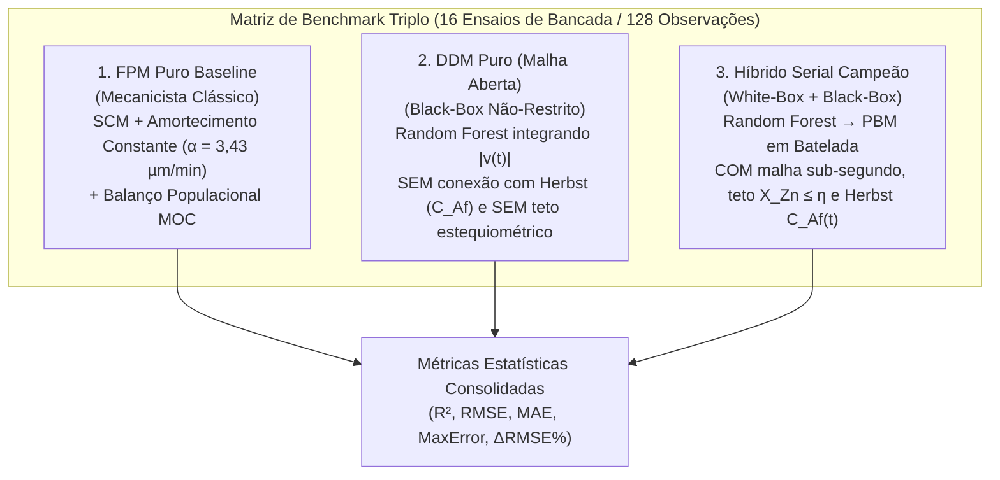

## 4.11. Protocolo de Avaliação In-Domain, Benchmark Triplo e Métricas Estatísticas

Nesta subseção é estabelecido o protocolo de validação comparativa *in-domain* abrangendo todos os 16 ensaios de lixiviação ácida de bancada de Bortot Coelho (2017). Detalham-se a estrutura metodológica do benchmark triplo (confrontando o modelo puramente mecanicista tradicional, o modelo puramente orientado por dados em malha aberta e o modelo híbrido serial), a definição analítica das métricas estatísticas e físico-químicas de avaliação e o procedimento de verificação de estabilidade frente a algoritmos de aprendizado de máquinas alternativos.

---

### 4.11.1. Estrutura do Benchmark Triplo de Modelagem

Para quantificar com rigor e imparcialidade os ganhos preditivos e as garantias termodinâmicas propiciadas pela modelagem híbrida, formulou-se um protocolo experimental de simulação comparativa estruturado em três paradigmas metodológicos concorrentes:

Figura 4.7 – Desenho experimental do benchmark triplo de modelagem cinotécnica.  
Fonte: Elaborada pelos autores (2026).

Os três modelos avaliados no benchmark compartilham exatamente as mesmas condições de contorno operacionais ($T = 40\ ^\circ\text{C}$, $C_{A0} \in [0,10; 1,50]\ \text{mol/L}$, $\eta \in [0,5; 3,1]$ e a mesma distribuição granulométrica de Rosin-Rammler-Bennet com $D_{63,2} = 46,27\ \mu\text{m}$), diferenciando-se exclusivamente pelo mecanismo constitutivo que governa a velocidade de dissolução:

1. **Modelo Fenomenológico Puro Baseline (*First-Principles Model* — FPM Puro)**:
   Representa o estado da arte mecanicista tradicional (Bortot Coelho, 2017). A taxa de retração interfacial $|v(t)|$ é calculada pela lei analítica do Modelo do Núcleo em Diminuição (SCM) com o parâmetro empírico de amortecimento cinético constante fixado em $\alpha = 3{,}43\ \mu\text{m}\cdot\text{min}^{-1}$ (Subseção 4.4). A evolução de $X_{\text{Zn}}(t)$ decorre da integração acoplada via Método das Características (`BatchPBMSolver`);
2. **Modelo Orientado por Dados em Malha Aberta (*Data-Driven Model* — DDM Puro)**:
   Representa a aplicação ingênua de inteligência artificial caixa-preta desprovida de barreira física. O algoritmo Random Forest infere $|v(t)|$ unicamente a partir de $[T, C_{A0}, \eta, t]$, e o deslocamento acumulado $\delta(t) = \int_0^t |v(\tau)|\, d\tau$ é integrado e convoluído com a curva RRB sem qualquer conexão com o balanço de solvente residual de Herbst ($C_{Af}(t)$) e sem a imposição do teto estequiométrico imposto pelo reagente limitante ($X_{\text{Zn}} \le \eta$). Esse modelo serve como controle negativo para evidenciar as violações termodinâmicas do aprendizado de máquinas puro em meios de esgotamento ácido;
3. **Modelo Híbrido Serial Campeão (Random Forest $\to$ PBM)**:
   Representa a arquitetura central desenvolvida neste trabalho (Subseção 4.10). O regressor infere $|v(t)|$, a quadratura de sub-segundo integra $\delta(t)$, o `BatchPBMSolver` computa a deformação populacional e as leis fundamentais de conservação impõem $X_{\text{Zn}}(t) \in [0, \min(1, \eta)]$ e $C_{Af}(t) = \max(0, C_{A0}(1 - X_{\text{Zn}}/\eta))$.

Adicionalmente, para investigar a sensibilidade estrutural da topologia híbrida frente à natureza do regressor de entrada, o protocolo avalia os **Híbridos Alternativos**: MLP $\to$ PBM, XGBoost $\to$ PBM e SVR $\to$ PBM.

---

### 4.11.2. Definição Formal das Métricas Estatísticas de Aderência

A avaliação da capacidade preditiva e da concordância dimensional entre os perfis simulados e as determinações experimentais de bancada foi quantificada por cinco métricas estatísticas padronizadas (Willmott; Matsuura, 2005; Chicco; Warrens; Jurman, 2021):

#### 1. Coeficiente de Determinação ($R^2$)
Quantifica a proporção da variância total da conversão experimental de zinco explicada pelas predições do modelo:

$$R^2 = 1 - \frac{\sum_{i=1}^N \left( X_{\text{exp},i} - X_{\text{pred},i} \right)^2}{\sum_{i=1}^N \left( X_{\text{exp},i} - \overline{X}_{\text{exp}} \right)^2} \tag{4.57}$$

sendo $X_{\text{exp},i}$ a conversão experimental observada na triplicata no instante $t_i$, $X_{\text{pred},i}$ o valor predito pelo modelo para as mesmas condições e $\overline{X}_{\text{exp}} = \frac{1}{N} \sum_{i=1}^N X_{\text{exp},i}$ a média global das medições experimentais. Valores de $R^2$ próximos da unidade indicam aderência excelente, enquanto valores negativos denunciam que o preditor apresenta desempenho inferior à simples média dos dados experimentais (situação típica de modelos sem restrições em extrapolação).

#### 2. Raiz do Erro Quadrático Médio ($\text{RMSE}$)
Mede a magnitude média quadrática dos desvios residuais na mesma dimensão da variável dependente (adimensional em fração mássica):

$$\text{RMSE} = \sqrt{\frac{1}{N} \sum_{i=1}^N \left( X_{\text{exp},i} - X_{\text{pred},i} \right)^2} \tag{4.58}$$

O RMSE penaliza severamente grandes erros pontuais ou discrepâncias assintóticas localizadas em virtude da elevação quadrática das diferenças.

#### 3. Erro Médio Absoluto ($\text{MAE}$)
Expressa a média linear direta dos desvios absolutos, oferecendo uma interpretação física intuitiva do erro típico de conversão em pontos individuais:

$$\text{MAE} = \frac{1}{N} \sum_{i=1}^N \left| X_{\text{exp},i} - X_{\text{pred},i} \right| \tag{4.59}$$

#### 4. Erro Residual Máximo ($\text{MaxError}$)
Identifica a pior discrepância pontual registrada em toda a série temporal:

$$\text{MaxError} = \max_{1 \le i \le N} \left| X_{\text{exp},i} - X_{\text{pred},i} \right| \tag{4.60}$$

Esta métrica é vital para certificar que o modelo não cometa desvios inaceitáveis de balanço de massa (por exemplo, erros superiores a 20% de conversão) em nenhum instante isolado da lixiviação.

#### 5. Redução Percentual de Erro Relativo ($\Delta\text{RMSE}\%$)
Avalia o ganho de acurácia conferido pela abordagem híbrida frente ao modelo fenomenológico puramente mecanicista tradicional (FPM):

$$\Delta\text{RMSE}\% = 100 \cdot \left( \frac{\text{RMSE}_{\text{FPM}} - \text{RMSE}_{\text{Híbrido}}}{\text{RMSE}_{\text{FPM}}} \right) \tag{4.61}$$

Um valor positivo de $\Delta\text{RMSE}\%$ indica redução percentual líquida no erro de predição, traduzindo o benefício prático do acoplamento dos modelos de aprendizado de máquinas.

---

### 4.11.3. Protocolo de Simulação e Consolidação de Artefatos

O protocolo computacional da Subetapa 4.2 (executado pelo script `avaliar_hibrido_indomain.py`) processa os 16 ensaios de bancada sob três níveis de agregação metrológica:
1. **Avaliação Global**: computada sobre as 128 medições experimentais pareadas ($16\ \text{ensaios} \times 8\ \text{tempos}$), avaliando o comportamento holístico do modelo em toda a janela experimental;
2. **Avaliação por Partição Espacial**: segregando o desempenho entre o conjunto de calibração (13 ensaios, 104 pontos) e o conjunto de teste cego independente (Ensaios 8, 14 e 7, 24 pontos), certificando a ausência de viés de calibração;
3. **Avaliação por Nível Estequiométrico ($\eta$)**: desagregando as métricas nos quatro regimes operacionais ($\eta = 0{,}5$; $\eta = 1{,}0$; $\eta = 1{,}5$; $\eta = 3{,}1$) para isolar os mecanismos de desvio físico-químico associados à disponibilidade de solvente ácido.

A Tabela 4.11 sintetiza o delineamento dos artefatos tabulares e gráficos exportados para a composição da Seção 5 (Resultados e Discussão).

Tabela 4.11 – Matriz de artefatos produzidos pelo protocolo de avaliação *in-domain*.

| Artefato Científico | Formato / Resolução | Diretório de Destino | Conteúdo Metodológico |
| :--- | :---: | :---: | :--- |
| **Painel de Reconstrução Cinética** | PNG (300 DPI) + PDF | `outputs/etapa_4_2/` | Gráfico 4x4 (`fig_12a`) comparando as curvas $X_{\text{Zn}}(t)$ dos 16 ensaios para os três modelos e dados experimentais |
| **Gráfico de Paridade 1:1** | PNG (300 DPI) + PDF | `outputs/etapa_4_2/` | Dispersão pareada $X_{\text{pred}}$ vs. $X_{\text{exp}}$ (`fig_12b`) com bandas de tolerância de $\pm 5\%$ e $\pm 10\%$ |
| **Gráficos de Barras Comparativos** | PNG (300 DPI) + PDF | `outputs/etapa_4_2/` | Comparação global de $R^2$ e RMSE (`fig_12c`) nas partições de treino, teste e global |
| **Heatmap de Ganho Relativo** | PNG (300 DPI) + PDF | `outputs/etapa_4_2/` | Matriz bidimensional 4x4 (`fig_12d`) ilustrando o ganho $\Delta R^2$ e redução de RMSE no plano ($C_{A0} \times \eta$) |
| **Tabela de Predições Pareadas** | CSV (128 linhas) | `outputs/etapa_4_2/` | Registro completo ensaio a ensaio contendo tempos, valores experimentais e predições dos 3 modelos |
| **Tabela de Métricas Ensaio a Ensaio** | CSV (16 linhas) | `outputs/etapa_4_2/` | Tabela consolidada com $R^2$, RMSE, MAE e MaxError calculados individualmente para cada ensaio |
| **Tabela Comparativa de 4 Híbridos** | CSV | `outputs/etapa_4_2/` | Estudo de sensibilidade confrontando Híbrido RF, Híbrido MLP, Híbrido XGBoost e Híbrido SVR |

Fonte: Elaborada pelos autores (2026).

Com o fechamento desta subseção, conclui-se formalmente todo o arcabouço de Materiais e Métodos (Seção 4). A análise aprofundada dos comportamentos cinéticos observados, a comparação visual dos perfis dinâmicos simulados e a interpretação físico-química dos ganhos estatísticos alcançados pelo modelo híbrido são apresentadas e discutidas na **Seção 5 (Resultados e Discussão)**.
